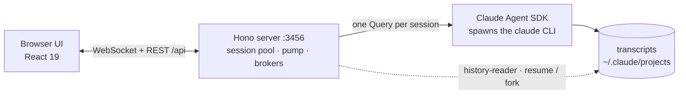
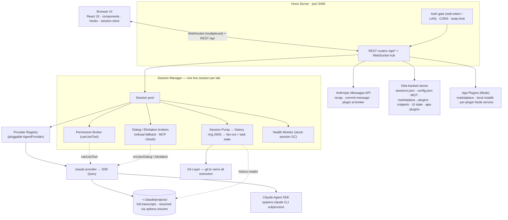

<div align="center">

<h1>claude-react-web</h1>

<p><b>Run and steer Claude agents from your browser — multi-session, permission-gated, git-aware.</b></p>

<p>
  <a href="https://www.npmjs.com/package/claude-react-web"></a>
  <a href="https://www.npmjs.com/package/claude-react-web"></a>
  <a href="https://github.com/LoopGe/claude-react-web/actions/workflows/ci.yml"></a>
  <a href="./LICENSE"></a>
  <a href="https://nodejs.org/"></a>
  <a href="#contributing"></a>
</p>

<p>
  <a href="#quick-start">Quick start</a> ·
  <a href="#features">Features</a> ·
  <a href="#screenshots">Screenshots</a> ·
  <a href="#cli-reference">CLI</a> ·
  <a href="#architecture">Architecture</a> ·
  <a href="#contributing">Contributing</a> ·
  <a href="./CHANGELOG.md">Changelog</a>
</p>

<p>
  <b>English</b> · <a href="./README.zh-CN.md">简体中文</a> ·
  <a href="./docs/manual.en.md">User manual</a>
</p>

</div>

<p align="center">
  
</p>

<!-- Maintainers: README.zh-CN.md mirrors this file. Update both together. -->

A local browser UI for [`@anthropic-ai/claude-agent-sdk`](https://www.npmjs.com/package/@anthropic-ai/claude-agent-sdk). Ships as a single `npx` binary that serves both the API and a built React client — a full Claude Code-style experience, in a real browser.

Each chat session holds its own stateful SDK `Query` on the server, so multi-turn conversations, mid-run interruption, model switching, and permission-mode changes all drive a live `claude` CLI subprocess. What you do in the browser is reflected in a real agent process.

## Why claude-react-web?

- **Sessions that outlive the terminal.** Conversations persist across restarts and resume from disk. Keep up to three side-by-side, and come back to any of them later.
- **Not a chat wrapper.** It drives the real agent loop — tool calls, subagents, background tasks, plan mode, MCP, hooks — rather than reimplementing a chatbot. A few CLI capabilities are deliberately not surfaced yet; the [manual appendix](./docs/manual.en.md#appendix-capabilities-not-yet-exposed-in-the-ui) tracks them.
- **Safety you can see.** In the default mode every tool call is a reviewable dialog — allow once, allow for the session, or deny with a reason. Plan mode, file rewind, and per-session approvals give you an undo path a terminal doesn't.
- **Runs entirely on your machine.** One process, one port, no account, no telemetry. Credentials stay in your local config file.
- **Reachable from your phone.** Bind to your LAN and scan a QR code to pick up the same session on another device.

## Requirements

- **Node.js ≥ 20**
- The **`claude` CLI** available on `PATH` — the SDK spawns it as a subprocess. Override with `--claude-binary` or `CLAUDE_CODE_BINARY` if auto-detection picks the wrong native build.
- An **Anthropic credential** (`authToken`, plus an optional `baseUrl`). See [Quick start](#quick-start).

## Quick start

```bash
npm i -g claude-react-web
claude-react-web
```

Or run it without installing:

```bash
npx claude-react-web
```

Either way the server starts on `http://127.0.0.1:3456` and opens your browser.

<details>
<summary>Run from source instead</summary>

```bash
git clone https://github.com/LoopGe/claude-react-web.git
cd claude-react-web
npm install
npm run build
npm run start
```

</details>

On first run a starter `~/.claude-react-web/config.json` is scaffolded. Set your credentials there before sending messages — the server forwards them to the Claude SDK subprocess:

```json
{
  "authToken": "sk-ant-...",
  "baseUrl": "https://api.anthropic.com"
}
```

`authToken` is sent as a Bearer token, so it works against both the official API and Anthropic-compatible proxies (point `baseUrl` at the relay). You can also fill these in from the in-app settings panel. See [CONFIG.md](./CONFIG.md) for every field.

## Features

### Chat & sessions

- Up to **three conversations side-by-side**, organised into reorderable groups that persist across refreshes
- Streaming over a **single multiplexed WebSocket** per tab, with fine-grained status (thinking / writing / tool use)
- **Paste or drop images** straight into the composer — sent inline as multimodal content
- Full-text **message search**, one-click **AI recaps**, and predicted next-prompt suggestions
- A **command palette** (`Cmd/Ctrl+K`) for fuzzy search across sessions and actions, plus a full set of global shortcuts

### Agents & background work

- Launch subagents and watch them in flight — the swarm pill expands into per-agent progress, current tool, and elapsed time
- **Background an in-flight task** with `Ctrl+B` and follow the whole task list live
- Sessions keep working while you move between panels

### Control & safety

- In the default permission mode every tool call is approval-gated: **allow once**, **allow for session**, or **deny with a message** — the model re-plans instead of aborting
- **Plan mode** with review-and-take-over, and `Shift+Tab` cycling through the permission modes (auto-accept, bypass) when you want less friction
- **Interrupt a running turn** at any time; switch model or permission mode mid-conversation
- Adaptive extended thinking and effort control on models that support them

### Git & workspace

- Branch + dirty / ahead / behind chip in every panel header, with a full panel for status, diff, branches, and stashes
- Stage, unstage, discard, commit, stash, checkout, and abort merges or rebases without leaving the app
- **AI-generated commit messages** written from your actual diff
- **Rewind tracked files** to any point in the conversation — with a dry-run preview before anything is touched

### Extensibility

- **MCP** — global servers, dynamic per-session servers, runtime reconnect / toggle, and inline OAuth elicitation
- **App Plugins (Mods)** — install from a marketplace or a local directory to add menus, commands, settings, and panels to the app shell
- **Claude plugins, skills, hooks, and custom agents**, managed per session
- Composer snippets and slash-command discovery

### Ops & access

- Dark / light / system themes with selectable skins
- **LAN access** — scan a QR code and use the same instance from your phone, protected by an access token
- Per-session **cost, token, and context usage**, plus a live performance panel and structured logs
- `doctor` for environment checks and `update` for upgrade detection

## Screenshots

<table>
  <tr>
    <td width="50%"><br><b>Transcript &amp; tool cards</b><br><sub>Collapsible tool calls, thinking lines, and per-turn cost — <a href="./docs/manual.en.md#3-conversations-and-messages">manual §3</a></sub></td>
    <td width="50%"><br><b>Subagents in flight</b><br><sub>Launch an agent, keep working, follow it live — <a href="./docs/manual.en.md#6-background-tasks-and-subagents">manual §6</a></sub></td>
  </tr>
  <tr>
    <td width="50%"><br><b>Tool permission dialog</b><br><sub>Approve once, for the session, or deny with a reason — <a href="./docs/manual.en.md#5-permissions-and-safety">manual §5</a></sub></td>
    <td width="50%"><br><b>Git panel</b><br><sub>Stage, commit, branch, stash, and generate messages — <a href="./docs/manual.en.md#7-git-integration">manual §7</a></sub></td>
  </tr>
  <tr>
    <td width="50%"><br><b>App Plugins (Mods)</b><br><sub>Marketplace or local installs — <a href="./docs/manual.en.md#8-extending-it-mcp-plugins-agents-skills-hooks">manual §8</a></sub></td>
    <td width="50%"><br><b>Session usage &amp; cost</b><br><sub>Tokens, cache, spend, and plan limits — <a href="./docs/manual.en.md#9-settings">manual §9</a></sub></td>
  </tr>
</table>

📖 **[User manual](./docs/manual.en.md)** — a guided tour of every screen, with screenshots ([中文版](./docs/manual.zh-CN.md)).

## CLI reference

| Flag                           | Description                                                                                                                                                                       |
| ------------------------------ | --------------------------------------------------------------------------------------------------------------------------------------------------------------------------------- |
| `-p, --port <port>`            | Server port (default: `3456`)                                                                                                                                                     |
| `--host <host>`                | Bind host (default: `127.0.0.1`). `0.0.0.0` allows LAN access and **requires** a web access token, auto-generated if `--token` is omitted                                         |
| `--token <token>`              | Shared web access token. Visitors supply it once via `/?token=<token>` and a cookie is set. Pin a stable value here or as `accessToken` in `config.json`                          |
| `-o, --open` / `--no-open`     | Open a browser on start (default: open)                                                                                                                                           |
| `--cwd <path>`                 | Default cwd advertised to new sessions (informational)                                                                                                                            |
| `--model <name>`               | Default model advertised to new sessions (informational)                                                                                                                          |
| `--state-dir <path>`           | Where session metadata and `config.json` live (default: `~/.claude-react-web`)                                                                                                    |
| `--claude-binary <path>`       | Path to the `claude` CLI binary. Overrides `CLAUDE_CODE_BINARY` and `PATH` auto-detection — useful when the SDK picks the wrong native build (e.g. a musl binary on a glibc host) |
| `--dev` / `--no-dev`           | Register the dev-only `appdebug` introspection tools (logs, metrics, session internals). Default: on when running from TypeScript source, off for `dist/cli.mjs`                  |
| `--disable-app-plugins`        | Disable the App Plugins (Mods) subsystem entirely                                                                                                                                 |
| `--safe-mode`                  | Load App Plugins without background subprocesses — static UI contributions only                                                                                                   |
| `-V, --version` / `-h, --help` | Print version / help                                                                                                                                                              |

<details>
<summary>Full <code>--help</code> output</summary>

```
claude-react-web — local interactive chat powered by @anthropic-ai/claude-agent-sdk

Usage:
  claude-react-web [options]

Options:
  -p, --port <port>    Server port (default: 3456)
      --host <host>    Bind host (default: 127.0.0.1). Use 0.0.0.0 to allow
                       LAN access (e.g. from a phone) — this REQUIRES a web
                       access token (auto-generated if --token is omitted).
      --token <token>  Shared web access token required to use the UI. When
                       set, every visitor must supply it via /?token=<token>
                       once (a cookie is then set). Auto-generated when the
                       host is non-loopback and no token is configured. Pin
                       a stable value here or as "accessToken" in config.json.
  -o, --open           Open browser on start (default)
      --no-open        Do not open a browser window
      --cwd <path>     Default cwd advertised to new sessions (informational)
      --model <name>   Default model advertised to new sessions (informational)
      --state-dir <p>  Where to keep session metadata and config.json
                       (default: ~/.claude-react-web)
      --claude-binary <path>
                       Path to the claude CLI binary. Default: resolved from
                       CLAUDE_CODE_BINARY env or `which claude`. Use this if
                       the SDK's auto-detection picks a wrong native build
                       (e.g. musl binary on a glibc host).
      --dev            Register the dev-only `appdebug` introspection tools
                       (logs, metrics, session internals). Default: auto —
                       on when the server runs from TypeScript source
                       (npm run dev / dev:server), off for dist/cli.mjs.
      --no-dev         Force the dev tools off even when running from source.
  -V, --version        Print version and exit
  -h, --help           Show this help and exit
```

</details>

When bound to a non-loopback host the server prints a token-bearing URL (plus a scannable QR code) so you can open the already-authenticated UI from a phone on the same network.

### Terminal commands

Run with no command to start the web server. Pass a subcommand to manage the same persisted config the UI edits — headless and scriptable (`--json` for structured output, `--yes` to confirm destructive verbs, `--state-dir <path>` to target a non-default state dir):

```
claude-react-web mcp list | add <name> | update <name> | remove <name> | enable <name> | disable <name> | test <name>
claude-react-web marketplace add <url> | list | remove <id-or-url>
claude-react-web app-plugin marketplace add <url> | list | remove <id>
claude-react-web app-plugin list | install <marketplaceId>:<pluginName> | uninstall <id>
claude-react-web config get [key] | set <key> <value>
claude-react-web sessions list | delete <id>
claude-react-web doctor
claude-react-web update
```

`claude-react-web doctor` runs local environment checks and exits non-zero when something is broken; `claude-react-web update` checks the npm registry for a newer release. `claude-react-web <command> --help` prints the full flags for a command.

### Environment variables

Anthropic credentials live in `config.json` (`authToken` / `baseUrl`), not in env vars — the server injects them into each SDK subprocess. The variables below tune the server itself and are all optional:

| Variable                    | What it does                                                                            | Default                 |
| --------------------------- | --------------------------------------------------------------------------------------- | ----------------------- |
| `CLAUDE_CODE_BINARY`        | Path to the `claude` CLI binary (same as `--claude-binary`)                             | auto-detected on `PATH` |
| `CLAUDE_CONFIG_DIR`         | Overrides the Claude config directory used to locate **subagent** transcripts           | `~/.claude`             |
| `LOG_LEVEL`                 | Log verbosity (`error` / `warn` / `info` / `debug` / `trace`)                           | `info`                  |
| `LOG_SCOPES`                | Comma-separated scope filter for logs (`*` matches all)                                 | all scopes              |
| `DEBUG_SESSION`             | Set to `1` to force `LOG_LEVEL=debug` (back-compat alias)                               | —                       |
| `EVENT_LOOP_PROBE`          | Set to `0` to disable the event-loop stall probe                                        | enabled                 |
| `EVENT_LOOP_PROBE_MS`       | Event-loop probe sample interval, in milliseconds                                       | `5000`                  |
| `EVENT_LOOP_PROBE_QUIET_MS` | Blocking threshold above which a probe window is reported                               | `100`                   |
| `METRICS`                   | Set to `0` to disable metrics collection (`GET /api/metrics` returns an empty snapshot) | enabled                 |

Any other `ANTHROPIC_*` variable in the environment is forwarded to the SDK subprocess as-is (except `ANTHROPIC_API_KEY`, which is intentionally stripped in favour of the `authToken` Bearer flow).

Session transcripts used for resume and fork are read from `~/.claude/projects/` — the SDK's own layout — regardless of `CLAUDE_CONFIG_DIR`, which currently affects subagent transcript lookup only.

### Configuration file

Most server-side defaults (model list, recap model, commit-message model, upload limits, history cap, max group panels, etc.) are configured via `~/.claude-react-web/config.json`. See [CONFIG.md](./CONFIG.md) for the full field reference, or copy [`config.example.json`](./config.example.json) to get started:

```bash
mkdir -p ~/.claude-react-web
cp config.example.json ~/.claude-react-web/config.json
```

## Architecture

The server keeps **one live provider session per tab**. The default `claude` provider wraps an SDK `Query`; a background pump drains it and fans every message out to each WebSocket subscriber over a single multiplexed connection per tab.



Metadata is persisted in `~/.claude-react-web/sessions.json`, so sessions survive restarts; the SDK itself stores full conversation history in `~/.claude/projects/` and resumes it via `options.resume`.

<details>
<summary>Detailed diagram and source layout</summary>



```
server/
  cli.ts                # bin entry — argv, startup banner, QR, browser open
  app.ts                # Hono app: auth gate, CORS, body-limit, route mounting, static serve
  routes/               # REST routers: sessions, permissions, uploads, recap, config, health,
                        # marketplace (mp), git-write, update, search, skills, hooks, dialog,
                        # elicitation, reset, usage, ui-state
  session-manager.ts    # multi-session pool, provider wiring, WS fan-out, idle GC
  session-pump.ts       # drains each provider stream → history ring + subscribers + task state
  providers/            # AgentProvider interface + registry; claude provider wraps the SDK Query
  permission-broker.ts  # parks canUseTool requests until the client decides
  elicitation-broker.ts # MCP OAuth elicitation requests
  user-dialog-broker.ts # user dialogs (refusal-fallback prompt)
  subagent-watcher.ts   # tracks background Agent dispatches → TaskRecordUi seeds
  session-health.ts     # stuck-session detector (mid-turn silence GC)
  recap.ts              # AI session summaries, via anthropic-api.ts
  commit-message.ts     # AI commit messages, via anthropic-api.ts
  compact-summary.ts    # session compaction summaries
  history-reader.ts     # reads ~/.claude/projects transcripts; resume / fork anchors
  ws.ts                 # WebSocket hub (single connection, multiplexed channels)
  git.ts                # owns ALL git execution (runGit); git-broadcast.ts debounces mutations
  git-routes.ts         # read-only git endpoints (status, diff, log)
  fs-routes.ts          # directory-only browser for the cwd picker
  mcp-config.ts         # global MCP server store; mcp-routes.ts exposes it
  mp-store.ts           # homegrown git-repo marketplace → injects Options.plugins
  snippet-store.ts      # composer text macros (snippet-routes.ts)
  ui-state-store.ts     # session groups + sidebar order (json-file-store.ts backed)
  app-plugins/          # Mods: manager, store, per-plugin Node process, marketplace, host API
  config.ts             # centralised defaults from config.json
  persistence.ts        # ~/.claude-react-web/sessions.json read/write
  auth.ts               # web-access token gating (LAN)
  exec.ts               # child_process helpers; process-monitor.ts watches subprocesses
  update-checker.ts     # in-app upgrade detection (update-routes.ts)
  log.ts                # createLogger(scope) — all diagnostics go through this

shared/                 # types + logic shared by server and client
                        # ws-protocol, tasks, elicitation, user-dialog, rewind, reset, usage,
                        # account-info, app-plugins, hooks, skills, mcp-types, permission-request,
                        # search/, …

src/
  App.tsx               # multi-panel chat grid, sidebar, settings overlay, command palette
  components/           # Chat, Composer, MessageList, SessionList, GitPanel, TasksPanel,
                        # CommandPalette, MarketplaceTab, McpInstaller, AppPluginsTab,
                        # UsagePanel, RecapWindow, SubagentOverlay, …
  hooks/                # useWsHub, useChatStream, usePastedImages, usePermissionChannel,
                        # useGitStatus, useUpdateInfo, useUiState, useSessionRecap, useTaskInfo, …
  session-store/        # client-side message store (reducer + selectors, IDB transcript cache)
  search/               # full-text message search (extract, match, highlight)
  app-plugins/          # plugin UI contributions (menus, commands, panels)
```

The separate **App Plugins (Mods)** system (`server/app-plugins/`, `shared/app-plugins/`, `src/app-plugins/`) lets plugins extend the app shell with menus, commands, settings, and panels. Each plugin's background code runs in its own trusted Node subprocess over JSON-RPC/stdio; plugins are installed from a marketplace repo (the official catalog lives in [`plugins/`](./plugins/), published as a separate lightweight GitHub repo) or a local directory.

</details>

## Develop

```bash
npm install
npm run dev         # tsx watch server (:3456) + vite (:5174, /api proxied)
npm run typecheck
npm run lint
npm test
```

| Script              | What it does                                                                |
| ------------------- | --------------------------------------------------------------------------- |
| `npm run dev`       | Hot-reloading server + Vite dev server side by side                         |
| `npm run build`     | `vite build` → `dist/client` and esbuild → `dist/cli.mjs`, run concurrently |
| `npm run typecheck` | `tsc --noEmit` for both browser and Node tsconfigs                          |
| `npm run lint`      | ESLint (includes `react-hooks`)                                             |
| `npm run format`    | Prettier write                                                              |
| `npm test`          | Vitest (server unit tests + client hook tests)                              |
| `npm run verify`    | `typecheck` + `lint` + `test` + `build` in one go                           |

## Contributing

Issues and pull requests are welcome. The suite covers the session pool, persistence, git execution, permission broker, WebSocket hub, app-plugin runtime, keyboard shortcuts, and the client hooks — **320+ test files** with **4,000+ cases**. Please keep them green before opening a PR:

```bash
npm run verify
```

`npm test` must pass. Add tests alongside behaviour changes — the repo uses Vitest for both the Node server and the jsdom-based client hooks.

## Disclaimer

**This is an unofficial, community-built project.** It is not affiliated with, endorsed by, or sponsored by Anthropic. "Claude" and "Claude Code" are trademarks of Anthropic PBC. You are responsible for ensuring your use complies with Anthropic's terms of service and any applicable usage policies.

Your `authToken` is stored in `~/.claude-react-web/config.json` on your own machine. It is injected into the local SDK subprocess, and is also sent as a Bearer token from the server to the `baseUrl` you configure, for the server's own auxiliary API calls: session recaps, AI commit messages, compaction summaries, the auto-classifier, the App Plugin `ai.request` broker, and the settings connection test. It goes nowhere you have not configured.

## Changelog

See [CHANGELOG.md](./CHANGELOG.md) for release history.

## License

[MIT](./LICENSE)
