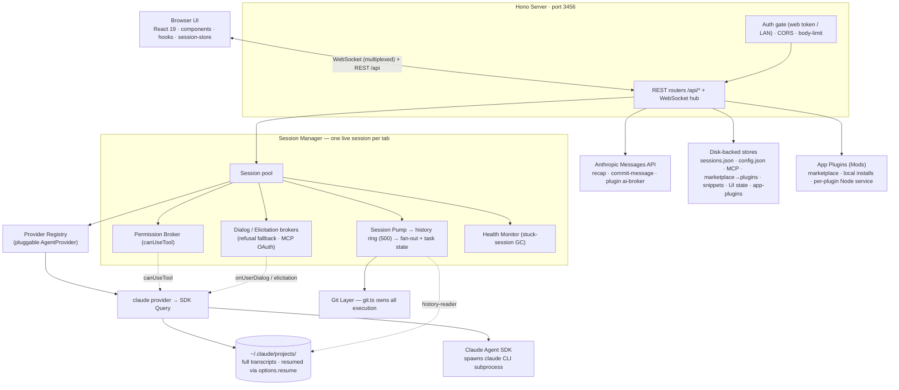

# claude-react-web

[](https://www.npmjs.com/package/claude-react-web)
[](https://www.npmjs.com/package/claude-react-web)
[](https://github.com/LoopGe/claude-react-web/actions/workflows/ci.yml)
[](./LICENSE)
[](https://nodejs.org/)

A local browser UI for [`@anthropic-ai/claude-agent-sdk`](https://www.npmjs.com/package/@anthropic-ai/claude-agent-sdk).

<p align="center">
  
</p>

## Features

- **Multi-session chat** — Up to 3 conversations side-by-side, organised into reorderable session groups that persist across refreshes
- **Streaming responses** — Real-time WebSocket streaming with fine-grained status (thinking / writing / tool use) and predicted next-prompt suggestions after each turn
- **Permission management** — Visual tool-usage approval with per-session and global persistence, plan-mode approval with "stop & take over", and `Shift+Tab` permission-mode cycling
- **Git integration** — Status, diff, branches, stashes, AI-generated commit messages, and rewinding tracked files to any point in the conversation
- **Background tasks** — Background an in-flight task (`Ctrl+B`), watch subagents, and follow their progress live
- **App plugins (Mods)** — Install plugins from a marketplace or a local directory to add menus, commands, settings, and panels to the app shell; each plugin runs its own trusted background service
- **Image paste** — Drag & drop or paste images directly into the chat (inline multimodal content)
- **Session search** — Full-text message search with highlighted matches and jump-to-result
- **AI recaps** — One-click AI-generated summaries of a session
- **MCP** — Configure global servers, add dynamic per-session servers, reconnect/toggle at runtime, and complete OAuth elicitation inline
- **Keyboard shortcuts** — `Cmd+K` command palette and a full set of global shortcuts
- **Themes & skins** — Dark / light / system modes with selectable skins (default, glow, Anthropic, high-contrast)
- **Flexible config** — Model, permission mode, MCP servers, thinking/effort level, and more via in-app settings or `config.json`
- **LAN access** — Scan a QR code to use from your phone on the same network

Each chat session holds its own stateful `Query` (the SDK's streaming async generator), so multi-turn conversations, mid-run interruption, model switching, and permission-mode changes all drive a live subprocess.

## Quick start

Install globally from npm and run:

```bash
npm i -g claude-react-web
claude-react-web
```

Or run it without installing via `npx`:

```bash
npx claude-react-web
```

Either way launches the server on `http://127.0.0.1:3456` and opens your browser.

<details>
<summary>Run from source instead</summary>

```bash
git clone https://github.com/LoopGe/claude-react-web.git
cd claude-react-web
npm install
npm run build
npm run start
```

</details>

On first run a starter `~/.claude-react-web/config.json` is scaffolded. Set your Anthropic credentials there before sending messages — the server forwards them to the Claude SDK subprocess:

```json
{
  "authToken": "sk-ant-...",
  "baseUrl": "https://api.anthropic.com"
}
```

`authToken` is sent as a Bearer token, so it works against both the official API and Anthropic-compatible proxies (point `baseUrl` at the relay). You can also fill these in from the in-app settings panel. See [CONFIG.md](./CONFIG.md) for every field.

### CLI options

```
claude-react-web [options]
  -p, --port <port>          Server port (default: 3456)
      --host <host>          Bind host (default: 127.0.0.1). Use 0.0.0.0 to
                             allow LAN access — this REQUIRES a web access
                             token (auto-generated if --token is omitted).
      --token <token>        Shared web access token required to use the UI.
                             Auto-generated when the host is non-loopback.
  -o, --open                 Open browser on start (default)
      --no-open              Do not open a browser window
      --cwd <path>           Default cwd advertised to new sessions
      --model <name>         Default model advertised to new sessions
      --state-dir <path>     Where session metadata + config.json are kept
                             (default: ~/.claude-react-web)
      --claude-binary <path> Path to the claude CLI binary (overrides
                             CLAUDE_CODE_BINARY / PATH auto-detection)
      --disable-app-plugins  Disable the App Plugins (Mods) subsystem
      --safe-mode            Load app plugins in safe mode — static UI
                             contributions only, no background subprocesses
  -V, --version              Print version and exit
  -h, --help                 Show help
```

When bound to a non-loopback host the server prints a token-bearing URL (plus a scannable QR code) so you can open the already-authenticated UI from a phone on the same network.

### Terminal commands

Run with no command to start the web server. Pass a subcommand to manage the
same persisted config the UI edits — headless and scriptable (`--json` for
structured output, `--yes` to confirm destructive verbs, `--state-dir <path>`
to target a non-default state dir):

```
claude-react-web mcp list | add <name> | update <name> | remove <name> | enable <name> | disable <name> | test <name>
claude-react-web marketplace add <url> | list | remove <id-or-url>
claude-react-web app-plugin marketplace add <url> | list | remove <id>
claude-react-web app-plugin list | install <marketplaceId>:<pluginName> | uninstall <id>
claude-react-web config get [key] | set <key> <value>
claude-react-web sessions list | delete <id>
claude-react-web doctor
claude-react-web update
```

`claude-react-web doctor` runs local environment checks and exits non-zero when
something is broken; `claude-react-web update` checks the npm registry for a
newer release. `claude-react-web <command> --help` prints the full flags for a
command.

### Environment variables

Anthropic credentials live in `config.json` (`authToken` / `baseUrl`), not in env vars — the server injects them into each SDK subprocess. The variables below tune the server itself and are all optional:

| Variable | What it does | Default |
| --- | --- | --- |
| `CLAUDE_CODE_BINARY` | Path to the `claude` CLI binary (same as `--claude-binary`) | auto-detected on `PATH` |
| `LOG_LEVEL` | Log verbosity (`error` / `warn` / `info` / `debug` / `trace`) | `info` |
| `LOG_SCOPES` | Comma-separated scope filter for logs | all scopes |
| `DEBUG_SESSION` | Set to `1` to force `LOG_LEVEL=debug` (back-compat alias) | — |
| `EVENT_LOOP_PROBE` | Set to `0` to disable the event-loop stall probe | enabled |

Any other `ANTHROPIC_*` variable in the environment is forwarded to the SDK subprocess as-is (except `ANTHROPIC_API_KEY`, which is intentionally stripped in favour of the `authToken` Bearer flow).

### Configuration file

Most server-side defaults (model list, recap model, commit-message model, upload limits, history cap, max group panels, etc.) are configured via `~/.claude-react-web/config.json`. See [CONFIG.md](./CONFIG.md) for the full field reference, or copy [`config.example.json`](./config.example.json) to get started:

```bash
mkdir -p ~/.claude-react-web
cp config.example.json ~/.claude-react-web/config.json
```

## Develop

```bash
npm install
npm run dev         # tsx watch server (:3456) + vite (:5174, /api proxied)
npm run typecheck
npm run lint
npm test
```

Useful scripts:

| Script              | What it does                                             |
| ------------------- | -------------------------------------------------------- |
| `npm run dev`       | Hot-reloading server + Vite dev server side by side      |
| `npm run build`     | `vite build` → `dist/client` then esbuild → `dist/cli.mjs` |
| `npm run typecheck` | `tsc --noEmit` for both browser and Node tsconfigs       |
| `npm run lint`      | ESLint (includes `react-hooks`)                          |
| `npm run format`    | Prettier write                                           |
| `npm test`          | Vitest (server unit tests + client hook tests)           |
| `npm run verify`    | `typecheck` + `lint` + `test` + `build` in one go        |

## Architecture



```
server/
  cli.ts                # bin entry — argv, startup banner, QR, browser open
  app.ts                # Hono app: auth gate, CORS, body-limit, route mounting, static serve
  routes/               # REST routers: sessions, permissions, uploads, recap, config, health,
                        # marketplace (mp), git-write, update, search, skills, hooks, dialog,
                        # elicitation, reset, usage, ui-state
  session-manager.ts    # multi-session pool, provider wiring, WS fan-out, idle GC
  session-pump.ts       # drains each provider stream → history ring + subscribers + task state
  providers/            # AgentProvider interface + registry; claude provider wraps the SDK Query
  permission-broker.ts  # parks canUseTool requests until the client decides
  elicitation-broker.ts # MCP OAuth elicitation requests
  user-dialog-broker.ts # user dialogs (refusal-fallback prompt)
  subagent-watcher.ts   # tracks background Agent dispatches → TaskRecordUi seeds
  session-health.ts     # stuck-session detector (mid-turn silence GC)
  recap.ts              # AI session summaries, via anthropic-api.ts
  commit-message.ts     # AI commit messages, via anthropic-api.ts
  compact-summary.ts    # session compaction summaries
  history-reader.ts     # reads ~/.claude/projects transcripts; resume / fork anchors
  ws.ts                 # WebSocket hub (single connection, multiplexed channels)
  git.ts                # owns ALL git execution (runGit); git-broadcast.ts debounces mutations
  git-routes.ts         # read-only git endpoints (status, diff, log)
  fs-routes.ts          # directory-only browser for the cwd picker
  mcp-config.ts         # global MCP server store; mcp-routes.ts exposes it
  mp-store.ts           # homegrown git-repo marketplace → injects Options.plugins
  snippet-store.ts      # composer text macros (snippet-routes.ts)
  ui-state-store.ts     # session groups + sidebar order (json-file-store.ts backed)
  app-plugins/          # Mods: manager, store, per-plugin Node process, marketplace, host API
  config.ts             # centralised defaults from config.json
  persistence.ts        # ~/.claude-react-web/sessions.json read/write
  auth.ts               # web-access token gating (LAN)
  exec.ts               # child_process helpers; process-monitor.ts watches subprocesses
  update-checker.ts     # in-app upgrade detection (update-routes.ts)
  log.ts                # createLogger(scope) — all diagnostics go through this

shared/                 # types + logic shared by server and client
                        # ws-protocol, tasks, elicitation, user-dialog, rewind, reset, usage,
                        # account-info, app-plugins, hooks, skills, mcp-types, permission-request,
                        # search/, …

src/
  App.tsx               # multi-panel chat grid, sidebar, settings overlay, command palette
  components/           # Chat, Composer, MessageList, SessionList, GitPanel, TasksPanel,
                        # CommandPalette, MarketplaceTab, McpInstaller, AppPluginsTab,
                        # UsagePanel, RecapWindow, SubagentOverlay, …
  hooks/                # useWsHub, useChatStream, usePastedImages, usePermissionChannel,
                        # useGitStatus, useUpdateInfo, useUiState, useSessionRecap, useTaskInfo, …
  session-store/        # client-side message store (reducer + selectors, IDB transcript cache)
  search/               # full-text message search (extract, match, highlight)
  app-plugins/          # plugin UI contributions (menus, commands, panels)
```

The server keeps one live provider session per tab — the default `claude` provider wraps the SDK `Query`, and `session-pump.ts` drains it, fanning each SDK message out to every WebSocket subscriber via a single multiplexed connection per tab. Metadata is persisted in `~/.claude-react-web/sessions.json`, so sessions survive restarts; the SDK itself stores full conversation history in `~/.claude/projects/` and resumes them via `options.resume`. Server-side defaults (model list, recap model, commit-message model, upload limits, etc.) are centralised in `config.ts` and configurable via `~/.claude-react-web/config.json` — see [CONFIG.md](./CONFIG.md).

The separate **App Plugins (Mods)** system (`server/app-plugins/`, `shared/app-plugins/`, `src/app-plugins/`) lets plugins extend the app shell with menus, commands, settings, and panels. Each plugin's background code runs in its own trusted Node subprocess over JSON-RPC/stdio; plugins are installed from a marketplace repo (the official catalog lives in [`plugins/`](./plugins/), published as a separate lightweight GitHub repo) or a local directory. `--disable-app-plugins` and `--safe-mode` control the subsystem at launch.

## Contributing

Issues and pull requests welcome. The codebase has 2,500+ tests across ~170 files covering the session pool, persistence, git execution, permission broker, WebSocket hub, app-plugin runtime, keyboard shortcuts, and the client hooks — please keep them green (`npm test`).

## License

[MIT](./LICENSE)
