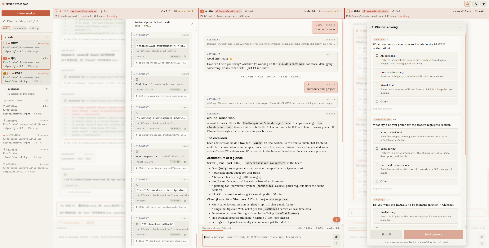
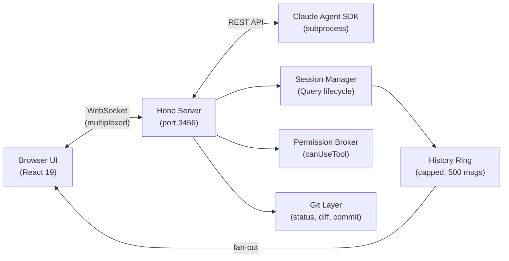

# claude-react-web

[](https://www.npmjs.com/package/claude-react-web)
[](https://www.npmjs.com/package/claude-react-web)
[](https://github.com/LoopGe/claude-react-web/actions/workflows/ci.yml)
[](./LICENSE)
[](https://nodejs.org/)

A local browser UI for [`@anthropic-ai/claude-agent-sdk`](https://www.npmjs.com/package/@anthropic-ai/claude-agent-sdk).

<p align="center">
  
</p>

## Features

- **Multi-session chat** — Up to 3 conversations side-by-side in a 3-column grid
- **Streaming responses** — Real-time SSE streaming with fine-grained status (thinking / writing / tool use)
- **Permission management** — Visual tool-usage approval with per-session and global persistence
- **Git integration** — Status, diff, branches, stashes, and AI-generated commit messages
- **Image paste** — Drag & drop or paste images directly into the chat
- **Keyboard shortcuts** — `Cmd+K` command palette, `Shift+Tab` permission cycling, global shortcuts
- **Flexible config** — Model, permission mode, MCP servers, and more via in-app settings or `config.json`
- **LAN access** — Scan a QR code to use from your phone on the same network

Each chat session holds its own stateful `Query` (the SDK's streaming async generator), so multi-turn conversations, mid-run interruption, model switching, and permission-mode changes all drive a live subprocess.

## Quick start

Install globally from npm and run:

```bash
npm i -g claude-react-web
claude-react-web
```

Or run it without installing via `npx`:

```bash
npx claude-react-web
```

Either way launches the server on `http://127.0.0.1:3456` and opens your browser.

<details>
<summary>Run from source instead</summary>

```bash
git clone https://github.com/LoopGe/claude-react-web.git
cd claude-react-web
npm install
npm run build
npm run start
```

</details>

On first run a starter `~/.claude-react-web/config.json` is scaffolded. Set your Anthropic credentials there before sending messages — the server forwards them to the Claude SDK subprocess:

```json
{
  "authToken": "sk-ant-...",
  "baseUrl": "https://api.anthropic.com"
}
```

`authToken` is sent as a Bearer token, so it works against both the official API and Anthropic-compatible proxies (point `baseUrl` at the relay). You can also fill these in from the in-app settings panel. See [CONFIG.md](./CONFIG.md) for every field.

### CLI options

```
claude-react-web [options]
  -p, --port <port>          Server port (default: 3456)
      --host <host>          Bind host (default: 127.0.0.1). Use 0.0.0.0 to
                             allow LAN access — this REQUIRES a web access
                             token (auto-generated if --token is omitted).
      --token <token>        Shared web access token required to use the UI.
                             Auto-generated when the host is non-loopback.
  -o, --open                 Open browser on start (default)
      --no-open              Do not open a browser window
      --cwd <path>           Default cwd for new sessions
      --model <name>         Default model for new sessions
      --state-dir <path>     Where session metadata + config.json are kept
                             (default: ~/.claude-react-web)
      --claude-binary <path> Path to the claude CLI binary (overrides
                             CLAUDE_CODE_BINARY / PATH auto-detection)
  -h, --help                 Show help
```

When bound to a non-loopback host the server prints a token-bearing URL (plus a scannable QR code) so you can open the already-authenticated UI from a phone on the same network.

### Environment variables

Anthropic credentials live in `config.json` (`authToken` / `baseUrl`), not in env vars — the server injects them into each SDK subprocess. The variables below tune the server itself and are all optional:

| Variable | What it does | Default |
| --- | --- | --- |
| `CLAUDE_CODE_BINARY` | Path to the `claude` CLI binary (same as `--claude-binary`) | auto-detected on `PATH` |
| `LOG_LEVEL` | Log verbosity (`error` / `warn` / `info` / `debug`) | `info` |
| `LOG_SCOPES` | Comma-separated scope filter for logs | all scopes |
| `EVENT_LOOP_PROBE` | Set to `0` to disable the event-loop stall probe | enabled |

Any other `ANTHROPIC_*` variable in the environment is forwarded to the SDK subprocess as-is (except `ANTHROPIC_API_KEY`, which is intentionally stripped in favour of the `authToken` Bearer flow).

### Configuration file

Most server-side defaults (model list, recap model, commit-message model, upload limits, history cap, max open panels, etc.) are configured via `~/.claude-react-web/config.json`. See [CONFIG.md](./CONFIG.md) for the full field reference, or copy [`config.example.json`](./config.example.json) to get started:

```bash
mkdir -p ~/.claude-react-web
cp config.example.json ~/.claude-react-web/config.json
```

## Develop

```bash
npm install
npm run dev         # tsx watch server (:3456) + vite (:5174, /api proxied)
npm run typecheck
npm run lint
npm test
```

Useful scripts:

| Script              | What it does                                             |
| ------------------- | -------------------------------------------------------- |
| `npm run dev`       | Hot-reloading server + Vite dev server side by side      |
| `npm run build`     | `vite build` → `dist/client` then esbuild → `dist/cli.mjs` |
| `npm run typecheck` | `tsc --noEmit` for both browser and Node tsconfigs       |
| `npm run lint`      | ESLint (includes `react-hooks`)                          |
| `npm run format`    | Prettier write                                           |
| `npm test`          | Vitest (server unit tests + client hook tests)           |

## Architecture



```
server/
  cli.ts              # bin entry — parse argv, start server, open browser
  app.ts              # Hono app + static serve + route mounting
  routes/             # REST endpoints (sessions, permissions, uploads, config, git-write, …)
  git-routes.ts       # Read-only git endpoints; git.ts owns all git execution
  ws.ts               # WebSocket hub (single connection, multiplexed channels)
  ws-protocol.ts      # Shared frame types for the WebSocket wire format
  session-manager.ts  # Multi-session pool, Query lifecycle, WebSocket fan-out
  session-pump.ts     # Drains each Query generator into history + subscribers
  permission-broker.ts# Parks canUseTool requests until the client decides
  config.ts           # Centralised defaults loaded from config.json
  persistence.ts      # ~/.claude-react-web/sessions.json read/write
  auth.ts             # Web-access token gating
  pushable.ts         # Async iterable with push()
  fs-routes.ts        # Directory picker backend

src/
  App.tsx             # multi-panel chat grid, sidebar, settings overlay, command palette
  components/         # Chat, Composer, MessageList, SessionList, GitPanel, CommandPalette, …
  hooks/              # useWsHub, useChatStream, usePastedImages, usePermissionChannel, useKeyboardShortcuts, useGitStatus, …
```

The server keeps one live `Query` per session — `session-pump.ts` drains it and fans each SDK message out to every WebSocket subscriber via a single multiplexed connection per tab. Metadata is persisted in `~/.claude-react-web/sessions.json`, so sessions survive restarts; the SDK itself stores full conversation history in `~/.claude/projects/` and resumes them via `options.resume`. Server-side defaults (model list, recap model, commit-message model, upload limits, etc.) are centralised in `config.ts` and configurable via `~/.claude-react-web/config.json` — see [CONFIG.md](./CONFIG.md).

## Contributing

Issues and pull requests welcome. The codebase has 800+ tests across ~45 files covering the session pool, persistence, git execution, permission broker, WebSocket hub, keyboard shortcuts, and the client hooks — please keep them green (`npm test`).

## License

[MIT](./LICENSE)
