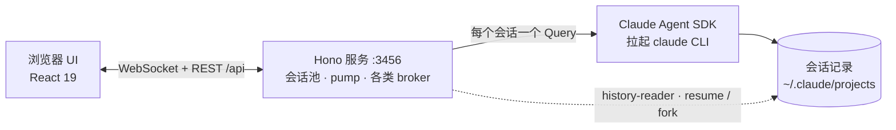
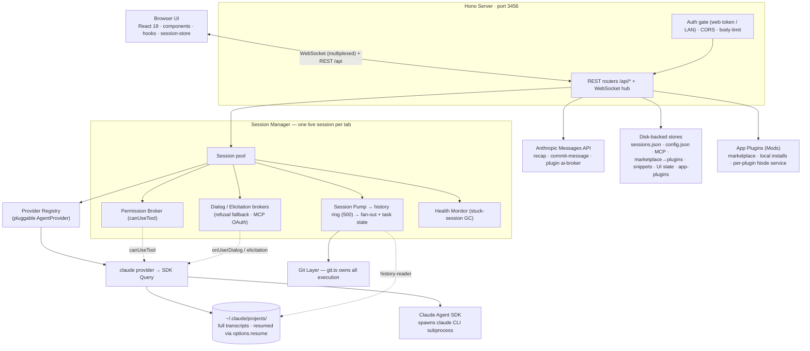

<div align="center">

<h1>claude-react-web</h1>

<p><b>在浏览器里运行并驾驭 Claude Agent —— 多会话、权限可控、深度集成 Git。</b></p>

<p>
  <a href="https://www.npmjs.com/package/claude-react-web"></a>
  <a href="https://www.npmjs.com/package/claude-react-web"></a>
  <a href="https://github.com/LoopGe/claude-react-web/actions/workflows/ci.yml"></a>
  <a href="./LICENSE"></a>
  <a href="https://nodejs.org/"></a>
  <a href="#参与贡献"></a>
</p>

<p>
  <a href="#快速开始">快速开始</a> ·
  <a href="#功能">功能</a> ·
  <a href="#界面截图">界面截图</a> ·
  <a href="#命令行参考">命令行</a> ·
  <a href="#架构">架构</a> ·
  <a href="#参与贡献">参与贡献</a> ·
  <a href="./CHANGELOG.md">更新日志</a>
</p>

<p>
  <a href="./README.md">English</a> · <b>简体中文</b> ·
  <a href="./docs/manual.zh-CN.md">用户手册</a>
</p>

</div>

<p align="center">
  
</p>

<!-- 维护提示：本文件与 README.md 一一对应，改动请同步两份。 -->

[`@anthropic-ai/claude-agent-sdk`](https://www.npmjs.com/package/@anthropic-ai/claude-agent-sdk) 的本地浏览器界面。以单个 `npx` 可执行文件分发，同时提供 API 与构建好的 React 客户端 —— 把完整的 Claude Code 体验搬进真正的浏览器。

每个聊天会话在服务端各自持有一个有状态的 SDK `Query`，因此多轮对话、运行中打断、切换模型、切换权限模式，都在驱动一个真实的 `claude` CLI 子进程。你在浏览器里的操作，会真实反映到一个 Agent 进程上。

## 为什么选 claude-react-web？

- **会话不再随终端消失。** 对话持久化保存、重启后可从磁盘恢复；最多三栏并排，随时回到任意一个。
- **不是聊天套壳。** 它驱动的是真实 Agent 循环 —— 工具调用、子代理、后台任务、Plan 模式、MCP、Hooks，而不是重造一个聊天机器人。少数 CLI 能力目前有意未在界面中开放，见[手册附录](./docs/manual.zh-CN.md#附录界面尚未开启的能力)。
- **安全动作看得见。** 默认模式下每次工具调用都是可审阅的对话框：允许一次 / 本会话允许 / 拒绝并说明理由。Plan 模式、文件回退与会话级授权，共同提供了终端给不了的后悔药。
- **完全跑在你自己机器上。** 单进程、单端口，无需注册账号，无遥测。凭证只留在本地配置文件里。
- **手机上也能接着用。** 绑定局域网后扫码，即可在另一台设备上接管同一个会话。

## 环境要求

- **Node.js ≥ 20**
- **`claude` CLI** 需在 `PATH` 中 —— SDK 会将它作为子进程拉起。若自动探测选错了原生构建，用 `--claude-binary` 或 `CLAUDE_CODE_BINARY` 覆盖。
- 一份 **Anthropic 凭证**（`authToken`，以及可选的 `baseUrl`）。见[快速开始](#快速开始)。

## 快速开始

```bash
npm i -g claude-react-web
claude-react-web
```

或者免安装直接运行：

```bash
npx claude-react-web
```

两种方式都会在 `http://127.0.0.1:3456` 启动服务并打开浏览器。

<details>
<summary>改用源码运行</summary>

```bash
git clone https://github.com/LoopGe/claude-react-web.git
cd claude-react-web
npm install
npm run build
npm run start
```

</details>

首次运行会生成一份初始 `~/.claude-react-web/config.json`。发送消息前请先在其中填入凭证 —— 服务端会把它们转发给 Claude SDK 子进程：

```json
{
  "authToken": "sk-ant-...",
  "baseUrl": "https://api.anthropic.com"
}
```

`authToken` 以 Bearer token 形式发送，因此官方 API 和 Anthropic 兼容代理都能用（把 `baseUrl` 指向中转即可）。也可以在应用内的设置面板里填写。完整字段见 [CONFIG.md](./CONFIG.md)。

## 功能

### 对话与会话

- **最多三栏并排**，可按分组自由排序，刷新后依然保持
- 每个标签页一条**多路复用 WebSocket** 承载全部实时数据，并给出细粒度状态（思考 / 输出 / 工具调用）
- **粘贴或拖入图片**，以多模态内容内联发送
- 消息**全文搜索**、一键 **AI 摘要**、以及下一句提示词预测
- **命令面板**（`Cmd/Ctrl+K`）可模糊搜索会话与操作，另有一整套全局快捷键

### Agent 与后台任务

- 派发子代理并实时观察 —— 聚合胶囊可展开为每个代理的进度、当前工具与耗时
- 用 `Ctrl+B` 把进行中的任务**转入后台**，并实时跟踪整个任务列表
- 在多个面板之间切换时，会话照常在后台推进

### 权限与安全

- 默认权限模式下每次工具调用都需授权：**允许一次**、**本会话允许**，或**拒绝并附上理由** —— 模型会重新规划，而不是中断整轮
- **Plan 模式**支持审阅后接管，`Shift+Tab` 可在各权限模式间循环切换（想要更少打断时可用 auto-accept / bypass）
- 随时**打断**正在运行的一轮；对话中途切换模型或权限模式
- 在支持的模型上启用自适应扩展思考与 Effort 控制

### Git 与工作区

- 每个面板标题栏常驻分支与 dirty / ahead / behind 指示，另有完整面板展示状态、diff、分支与 stash
- 无需离开应用即可 stage、unstage、discard、commit、stash、checkout，以及中止 merge / rebase
- **AI 生成提交信息**，依据真实的 diff 撰写
- **回退被跟踪的文件**到对话中任意节点 —— 动手前先给出 dry-run 预览

### 可扩展性

- **MCP** —— 全局服务器、按会话动态添加、运行时重连 / 启停，以及内联完成 OAuth 授权
- **App Plugins（Mods）** —— 从市场或本地目录安装，为应用外壳添加菜单、命令、设置与面板
- **Claude 插件、技能、Hooks、自定义 Agent**，均按会话管理
- 输入框快捷短语与斜杠命令自动发现

### 运维与访问

- 深色 / 浅色 / 跟随系统主题，并支持多套皮肤
- **局域网访问** —— 扫码即可在手机上使用同一实例，由访问令牌保护
- 按会话统计**费用、Token 与上下文用量**，另有实时性能面板与结构化日志
- `doctor` 检查本地环境，`update` 检测新版本

## 界面截图

<table>
  <tr>
    <td width="50%"><br><b>对话与工具卡片</b><br><sub>可折叠的工具调用、思考行与每轮开销 —— <a href="./docs/manual.zh-CN.md#3-对话与消息">手册 §3</a></sub></td>
    <td width="50%"><br><b>运行中的子代理</b><br><sub>派发后继续干活，实时跟踪结果 —— <a href="./docs/manual.zh-CN.md#6-后台任务与子代理">手册 §6</a></sub></td>
  </tr>
  <tr>
    <td width="50%"><br><b>工具授权对话框</b><br><sub>允许一次、本会话允许，或拒绝并说明理由 —— <a href="./docs/manual.zh-CN.md#5-权限与安全">手册 §5</a></sub></td>
    <td width="50%"><br><b>Git 面板</b><br><sub>暂存、提交、切分支、stash 与生成提交信息 —— <a href="./docs/manual.zh-CN.md#7-git-集成">手册 §7</a></sub></td>
  </tr>
  <tr>
    <td width="50%"><br><b>App Plugins（Mods）</b><br><sub>市场安装或本地目录安装 —— <a href="./docs/manual.zh-CN.md#8-扩展mcp插件agent技能hooks">手册 §8</a></sub></td>
    <td width="50%"><br><b>会话用量与费用</b><br><sub>Token、缓存、花费与套餐限额 —— <a href="./docs/manual.zh-CN.md#9-设置">手册 §9</a></sub></td>
  </tr>
</table>

📖 **[用户手册](./docs/manual.zh-CN.md)** —— 逐屏导览，配有截图（[English](./docs/manual.en.md)）。

## 命令行参考

| 参数                           | 说明                                                                                                                                          |
| ------------------------------ | --------------------------------------------------------------------------------------------------------------------------------------------- |
| `-p, --port <port>`            | 服务端口（默认 `3456`）                                                                                                                       |
| `--host <host>`                | 绑定地址（默认 `127.0.0.1`）。设为 `0.0.0.0` 可开放局域网访问，此时**必须**有访问令牌；未指定 `--token` 会自动生成                            |
| `--token <token>`              | Web 访问令牌。访问者首次通过 `/?token=<token>` 提供后即写入 Cookie。也可在 `config.json` 中用 `accessToken` 固定一个稳定值                    |
| `-o, --open` / `--no-open`     | 启动时是否打开浏览器（默认打开）                                                                                                              |
| `--cwd <path>`                 | 向新会话通告的默认工作目录（仅提示性质）                                                                                                      |
| `--model <name>`               | 向新会话通告的默认模型（仅提示性质）                                                                                                          |
| `--state-dir <path>`           | 存放会话元数据与 `config.json` 的目录（默认 `~/.claude-react-web`）                                                                           |
| `--claude-binary <path>`       | `claude` CLI 可执行文件路径，优先于 `CLAUDE_CODE_BINARY` 与 `PATH` 自动探测 —— 当 SDK 选错原生构建时使用（例如在 glibc 环境误选 musl 二进制） |
| `--dev` / `--no-dev`           | 注册仅供开发使用的 `appdebug` 内省工具（日志、指标、会话内部状态）。默认：从 TypeScript 源码运行时开启，`dist/cli.mjs` 下关闭                 |
| `--disable-app-plugins`        | 整体关闭 App Plugins（Mods）子系统                                                                                                            |
| `--safe-mode`                  | 以安全模式加载 App Plugins —— 仅静态界面贡献，不启动后台子进程                                                                                |
| `-V, --version` / `-h, --help` | 打印版本 / 帮助                                                                                                                               |

<details>
<summary>完整 <code>--help</code> 输出</summary>

```
claude-react-web — local interactive chat powered by @anthropic-ai/claude-agent-sdk

Usage:
  claude-react-web [options]

Options:
  -p, --port <port>    Server port (default: 3456)
      --host <host>    Bind host (default: 127.0.0.1). Use 0.0.0.0 to allow
                       LAN access (e.g. from a phone) — this REQUIRES a web
                       access token (auto-generated if --token is omitted).
      --token <token>  Shared web access token required to use the UI. When
                       set, every visitor must supply it via /?token=<token>
                       once (a cookie is then set). Auto-generated when the
                       host is non-loopback and no token is configured. Pin
                       a stable value here or as "accessToken" in config.json.
  -o, --open           Open browser on start (default)
      --no-open        Do not open a browser window
      --cwd <path>     Default cwd advertised to new sessions (informational)
      --model <name>   Default model advertised to new sessions (informational)
      --state-dir <p>  Where to keep session metadata and config.json
                       (default: ~/.claude-react-web)
      --claude-binary <path>
                       Path to the claude CLI binary. Default: resolved from
                       CLAUDE_CODE_BINARY env or `which claude`. Use this if
                       the SDK's auto-detection picks a wrong native build
                       (e.g. musl binary on a glibc host).
      --dev            Register the dev-only `appdebug` introspection tools
                       (logs, metrics, session internals). Default: auto —
                       on when the server runs from TypeScript source
                       (npm run dev / dev:server), off for dist/cli.mjs.
      --no-dev         Force the dev tools off even when running from source.
  -V, --version        Print version and exit
  -h, --help           Show this help and exit
```

</details>

绑定到非回环地址时，服务端会打印带令牌的 URL（以及可扫描的二维码），方便你用同一局域网内的手机直接打开已认证的界面。

### 终端子命令

不带子命令运行即启动 Web 服务。带子命令则可在无界面环境下脚本化管理与界面同一份持久化配置（`--json` 输出结构化结果，`--yes` 确认破坏性操作，`--state-dir <path>` 指定非默认状态目录）：

```
claude-react-web mcp list | add <name> | update <name> | remove <name> | enable <name> | disable <name> | test <name>
claude-react-web marketplace add <url> | list | remove <id-or-url>
claude-react-web app-plugin marketplace add <url> | list | remove <id>
claude-react-web app-plugin list | install <marketplaceId>:<pluginName> | uninstall <id>
claude-react-web config get [key] | set <key> <value>
claude-react-web sessions list | delete <id>
claude-react-web doctor
claude-react-web update
```

`claude-react-web doctor` 执行本地环境检查，异常时以非零码退出；`claude-react-web update` 检查 npm 上是否有新版本。`claude-react-web <command> --help` 打印该命令的完整参数。

### 环境变量

Anthropic 凭证放在 `config.json`（`authToken` / `baseUrl`）而非环境变量中 —— 服务端会把它们注入每个 SDK 子进程。下面这些变量用于调节服务端自身，全部可选：

| 变量                        | 作用                                                      | 默认值               |
| --------------------------- | --------------------------------------------------------- | -------------------- |
| `CLAUDE_CODE_BINARY`        | `claude` CLI 可执行文件路径（等同于 `--claude-binary`）   | 在 `PATH` 中自动探测 |
| `CLAUDE_CONFIG_DIR`         | 覆盖用于定位**子代理**会话记录的 Claude 配置目录          | `~/.claude`          |
| `LOG_LEVEL`                 | 日志级别（`error` / `warn` / `info` / `debug` / `trace`） | `info`               |
| `LOG_SCOPES`                | 按作用域过滤日志，逗号分隔（`*` 匹配全部）                | 全部作用域           |
| `DEBUG_SESSION`             | 设为 `1` 等价于 `LOG_LEVEL=debug`（向后兼容别名）         | —                    |
| `EVENT_LOOP_PROBE`          | 设为 `0` 关闭事件循环阻塞探针                             | 开启                 |
| `EVENT_LOOP_PROBE_MS`       | 事件循环探针采样间隔（毫秒）                              | `5000`               |
| `EVENT_LOOP_PROBE_QUIET_MS` | 超过该阻塞时长（毫秒）的采样窗口才会被上报                | `100`                |
| `METRICS`                   | 设为 `0` 关闭指标采集（`GET /api/metrics` 返回空快照）    | 开启                 |

环境中其他 `ANTHROPIC_*` 变量会原样转发给 SDK 子进程（`ANTHROPIC_API_KEY` 除外，它被有意剥离，以 `authToken` 的 Bearer 流程为准）。

resume 与 fork 所用的会话记录始终从 `~/.claude/projects/` 读取（SDK 自身的目录布局），不受 `CLAUDE_CONFIG_DIR` 影响 —— 该变量目前只影响子代理会话记录的查找。

### 配置文件

大多数服务端默认值（模型列表、摘要模型、提交信息模型、上传上限、历史条数上限、最大分组面板数等）都通过 `~/.claude-react-web/config.json` 配置。完整字段说明见 [CONFIG.md](./CONFIG.md)，也可以直接复制 [`config.example.json`](./config.example.json) 起步：

```bash
mkdir -p ~/.claude-react-web
cp config.example.json ~/.claude-react-web/config.json
```

## 架构

服务端**每个标签页对应一个存活的 provider 会话**。默认的 `claude` provider 包装一个 SDK `Query`；后台 pump 将其抽干，并通过每个标签页单独的多路复用连接，把每条消息扇出给所有 WebSocket 订阅者。



元数据持久化在 `~/.claude-react-web/sessions.json`，因此会话可跨越重启；SDK 自身把完整对话历史存放在 `~/.claude/projects/`，并通过 `options.resume` 恢复。

<details>
<summary>详细架构图与源码结构</summary>



```
server/
  cli.ts                # bin 入口 —— argv、启动横幅、二维码、打开浏览器
  app.ts                # Hono 应用：鉴权门、CORS、体积上限、路由挂载、静态资源
  routes/               # REST 路由：sessions, permissions, uploads, recap, config, health,
                        # marketplace (mp), git-write, update, search, skills, hooks, dialog,
                        # elicitation, reset, usage, ui-state
  session-manager.ts    # 多会话池、provider 接线、WS 扇出、空闲回收
  session-pump.ts       # 抽干每个 provider 流 → 历史环形缓冲 + 订阅者 + 任务状态
  providers/            # AgentProvider 接口与注册表；claude provider 包装 SDK Query
  permission-broker.ts  # 暂存 canUseTool 请求直到客户端裁决
  elicitation-broker.ts # MCP OAuth 授权请求
  user-dialog-broker.ts # 用户对话框（拒绝回退提示）
  subagent-watcher.ts   # 跟踪后台 Agent 派发 → 生成 TaskRecordUi 种子
  session-health.ts     # 卡死会话检测（轮次中途静默回收）
  recap.ts              # AI 会话摘要，经由 anthropic-api.ts
  commit-message.ts     # AI 提交信息，经由 anthropic-api.ts
  compact-summary.ts    # 会话压缩摘要
  history-reader.ts     # 读取 ~/.claude/projects 记录；resume / fork 锚点
  ws.ts                 # WebSocket 枢纽（单连接、多路复用通道）
  git.ts                # 唯一持有全部 git 执行（runGit）；git-broadcast.ts 做变更防抖
  git-routes.ts         # 只读 git 接口（status、diff、log）
  fs-routes.ts          # 仅目录浏览，供工作目录选择器使用
  mcp-config.ts         # 全局 MCP 服务器存储；mcp-routes.ts 暴露
  mp-store.ts           # 自制 git 仓库市场 → 注入 Options.plugins
  snippet-store.ts      # 输入框快捷短语（snippet-routes.ts）
  ui-state-store.ts     # 会话分组与侧栏顺序（json-file-store.ts 支撑）
  app-plugins/          # Mods：管理器、存储、每插件 Node 进程、市场、Host API
  config.ts             # 从 config.json 集中读取默认值
  persistence.ts        # ~/.claude-react-web/sessions.json 读写
  auth.ts               # Web 访问令牌门（局域网）
  exec.ts               # child_process 辅助；process-monitor.ts 监视子进程
  update-checker.ts     # 应用内升级检测（update-routes.ts）
  log.ts                # createLogger(scope) —— 所有诊断日志的唯一出口

shared/                 # 服务端与客户端共享的类型与逻辑
                        # ws-protocol, tasks, elicitation, user-dialog, rewind, reset, usage,
                        # account-info, app-plugins, hooks, skills, mcp-types, permission-request,
                        # search/, …

src/
  App.tsx               # 多面板聊天网格、侧栏、设置浮层、命令面板
  components/           # Chat, Composer, MessageList, SessionList, GitPanel, TasksPanel,
                        # CommandPalette, MarketplaceTab, McpInstaller, AppPluginsTab,
                        # UsagePanel, RecapWindow, SubagentOverlay, …
  hooks/                # useWsHub, useChatStream, usePastedImages, usePermissionChannel,
                        # useGitStatus, useUpdateInfo, useUiState, useSessionRecap, useTaskInfo, …
  session-store/        # 客户端消息存储（reducer + selectors，IDB 会话记录缓存）
  search/               # 消息全文搜索（提取、匹配、高亮）
  app-plugins/          # 插件界面贡献（菜单、命令、面板）
```

另一套独立的 **App Plugins（Mods）** 系统（`server/app-plugins/`、`shared/app-plugins/`、`src/app-plugins/`）让插件为应用外壳添加菜单、命令、设置与面板。每个插件的后台代码在各自的、受信任的 Node 子进程中通过 JSON-RPC/stdio 运行；插件可从市场仓库安装（官方目录位于 [`plugins/`](./plugins/)，作为独立的轻量 GitHub 仓库分发），也可从本地目录安装。

</details>

## 参与开发

```bash
npm install
npm run dev         # tsx watch 服务端 (:3456) + vite (:5174，/api 已代理)
npm run typecheck
npm run lint
npm test
```

| 脚本                | 作用                                                                   |
| ------------------- | ---------------------------------------------------------------------- |
| `npm run dev`       | 热重载服务端与 Vite 开发服务器并行                                     |
| `npm run build`     | `vite build` → `dist/client` 与 esbuild → `dist/cli.mjs`，两者并行执行 |
| `npm run typecheck` | 对浏览器与 Node 两套 tsconfig 分别 `tsc --noEmit`                      |
| `npm run lint`      | ESLint（含 `react-hooks`）                                             |
| `npm run format`    | Prettier 写入                                                          |
| `npm test`          | Vitest（服务端单测 + 客户端 Hook 测试）                                |
| `npm run verify`    | 依次执行 `typecheck` + `lint` + `test` + `build`                       |

## 参与贡献

欢迎提交 Issue 与 Pull Request。测试覆盖会话池、持久化、git 执行、权限 broker、WebSocket 枢纽、App Plugin 运行时、快捷键以及客户端 Hooks —— 目前有 **320+ 个测试文件**、**4000+ 条用例**。提 PR 前请保持全绿：

```bash
npm run verify
```

`npm test` 必须通过。行为变更请一并补测试 —— 服务端与基于 jsdom 的客户端 Hooks 都使用 Vitest。

## 免责声明

**本项目为非官方社区作品**，与 Anthropic 无隶属、背书或赞助关系。"Claude" 与 "Claude Code" 是 Anthropic PBC 的商标。请自行确保你的使用方式符合 Anthropic 的服务条款及相关使用政策。

你的 `authToken` 保存在本机的 `~/.claude-react-web/config.json` 中。它会被注入本地 SDK 子进程，同时也会由服务端以 Bearer token 形式发往你配置的 `baseUrl`，用于服务端自身的辅助 API 调用：会话摘要、AI 提交信息、压缩摘要、自动分类、App Plugin 的 `ai.request` 代理，以及设置中的连接测试。它不会流向任何你未配置的地址。

## 更新日志

发布历史见 [CHANGELOG.md](./CHANGELOG.md)。

## 许可证

[MIT](./LICENSE)
