# claude-react-web 使用手册

[English](./manual.en.md) | **中文**

> 这是面向**使用者**的手册 —— 假设你已经能在浏览器里打开界面，想搞清楚每个按钮是干什么的。
> 安装、命令行参数、架构与二次开发请看 [README](../README.md) 和 [CONFIG.md](../CONFIG.md)。
>
> 本手册所有截图取自**本仓库当前构建的真实运行界面**（Windows · 浅色主题 · `mimo-v2.5-pro`）。界面文案是英文，正文保留英文原文以便与界面一一对应。
>
> 快捷键按 Windows / Linux 的写法标注：macOS 上 `Ctrl` 即 `Cmd`（`Alt` 两平台一致）。

---

## 目录

- [0. 一分钟上手](#0-一分钟上手)
- [1. 界面总览](#1-界面总览)
- [2. 会话管理](#2-会话管理)
- [3. 对话与消息](#3-对话与消息)
- [4. 输入、附件与命令](#4-输入附件与命令)
- [5. 权限与安全](#5-权限与安全)
- [6. 后台任务与子代理](#6-后台任务与子代理)
- [7. Git 集成](#7-git-集成)
- [8. 扩展：MCP、插件、Agent、技能、Hooks](#8-扩展mcp插件agent技能hooks)
- [9. 设置](#9-设置)
- [10. 手机与局域网访问](#10-手机与局域网访问)
- [11. 快捷键](#11-快捷键)
- [12. 常见问题与排错](#12-常见问题与排错)
- [附录：界面尚未开启的能力](#附录界面尚未开启的能力)

---

## 0. 一分钟上手

**启动**（二选一）：

```bash
npx claude-react-web          # 免安装
npm i -g claude-react-web && claude-react-web
```

服务默认监听 `http://127.0.0.1:3456` 并自动打开浏览器。

**配好凭据**（第一次必须做）。凭据放在 `~/.claude-react-web/config.json` 的 `profiles` 里，也可以直接在浏览器里填：首次打开会出现 7 步向导 `SetupPage`：

| 步骤 | 内容 |
| --- | --- |
| 1 Environment | 检测 `claude` CLI 是否就绪（`Claude CLI is ready — {版本}` / `Claude CLI was not detected on this server.`） |
| 2 Auth Token | 填 `Auth Token *`（占位符 `sk-ant-...`）与可选的 `Base URL` |
| 3 Models | 维护 `Available Models` 列表、`Recap Model`、`Commit Message Model` |
| 4 MCP | 从 Claude CLI 的全局配置里挑选并导入 MCP 服务器（向导会显示它实际读取的文件路径） |
| 5 Notifications | 开启/关闭桌面通知 |
| 6 Updates | 设置更新检查源 |
| 7 Finish | `Create New Session` 或 `Skip` |

**然后**：点左上角 `+ New session`（或 `Alt+N`），选好工作目录，在底部输入框敲一句话回车 —— 就这么简单。

> `authToken` 以 Bearer 形式发送，所以官方 API 和任何 Anthropic 兼容中转都能用：把 `Base URL` 指向中转地址即可。

---

## 1. 界面总览

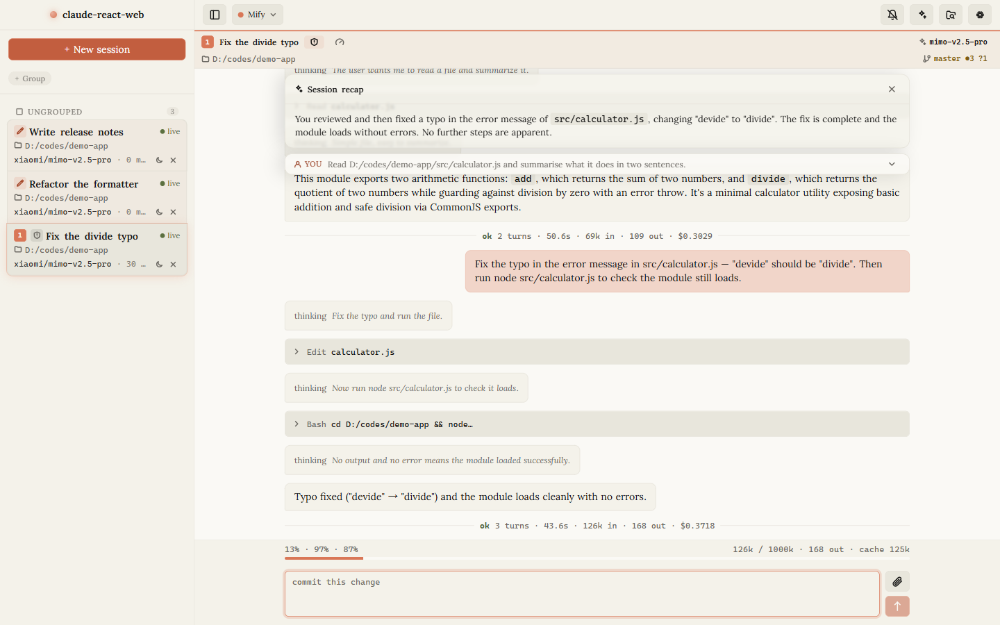

界面分三块：**左侧边栏**（会话列表）、**中间面板区**（最多 3 个会话并排）、**面板头部**（各种状态胶囊）。截图里顶部那张浮层是自动生成的 **Session recap**（见 [第 3 章](#34-recap会话回顾)）。

### 1.1 左侧边栏

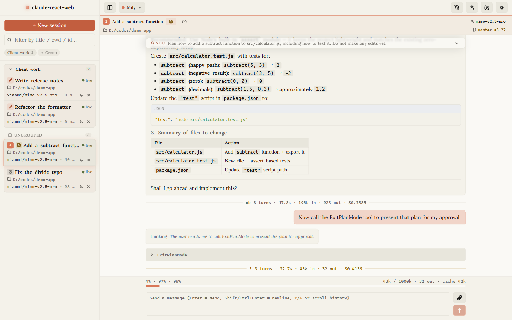

| 元素 | 说明 |
| --- | --- |
| `+ New session` | 新建会话（`Alt+N`）。**可以直接把文件夹从资源管理器拖到这里**，会自动填好工作目录 |
| `Filter by title / cwd / id...` | 会话多于 3 个时出现；按标题/目录/ID 过滤 |
| 分组行 | 每个分组是一个可点的胶囊（如 `Client work 2`），`+ Group` 新建。快捷键 `Alt+1`…`Alt+9` 切换分组，`Alt+Shift+↑/↓` 移动分组 |
| 会话卡片 | 标题、工作目录、`模型 · N msgs · N viewers`、状态徽标、休眠 `IconMoon`、删除 `IconX` |

**会话状态徽标**：`working`（正在跑）、`waiting`（回合结束但后台子代理还在跑）、`live`（空闲在线）、`dormant`（已休眠）、`resuming…`、`ended`、`err`。

**会话卡片右键菜单**（全部条目）：`Rename`、`Fork from this point`、`New session like this`、`Restart`、`Sleep (release resources)`、`Move up`/`Move down`、`Remove from group`、`Move to group ▸`、`Copy session ID`、`Copy working directory`、`Close panel`、`Accent colour…`、`Delete session`。

> 小技巧：双击卡片标题即可重命名。

### 1.2 面板头部的胶囊

每个会话面板头部一排小胶囊，从左到右：

| 胶囊 | 点击后 | 说明 |
| --- | --- | --- |
| 槽位号 `1/2/3` | 聚焦该面板 | 按住 `Ctrl` 会提示各面板编号，`Ctrl+1/2/3` 直接跳 |
| 会话标题 | 重新生成标题 | 悬停提示 `Click title to regenerate · <工作目录>` |
| 权限模式 | 打开模式菜单 | 显示原始模式名（`default`/`plan`/`acceptEdits`/`bypassPermissions`/`dontAsk`/`auto`） |
| `fast` | 开关快速模式 | 提示 `Fast mode: on/off · Opus-only · faster output, premium pricing · click to toggle` |
| Effort | 打开 `EffortSlider` | 推理深度与花费（`low`→`max`） |
| Persona | 选择自定义 Agent | `Persona: <名称> · its prompt, model and tool limits drive the main thread · click to change` |
| Thinking | 思考预算菜单 | `auto` / `off` / `4k`/`8k`/`16k`/`32k tokens` + `reasoning: default/summarized/hidden` |
| 模型 | 打开 `ModelPicker` | 切模型（下一次助手回合生效） |

第二排是 `working directory` 胶囊和 **Git 胶囊**（形如 `master ●3 ?1`，悬停显示分支/上游/同步/暂存/未暂存/未跟踪，点击打开 Git 面板）；如果 Agent 跑在 worktree 里，还会多一个 **worktree 胶囊**。

> `Thinking` 和 `Effort` 只在支持它们的模型上出现。本手册演示用的 `mimo-v2.5-pro` 两个都不支持，所以截图里看不到这两个胶囊 —— 这是正常的，不是界面缺功能。

### 1.3 命令面板与覆盖层

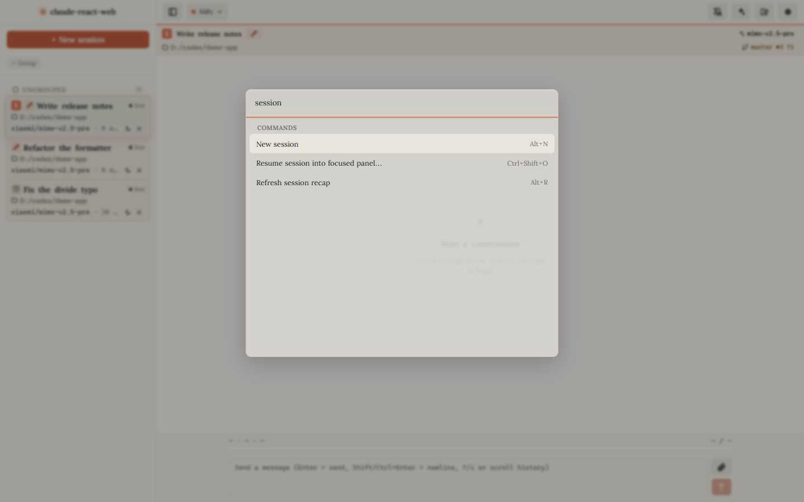

`Ctrl+K` 打开命令面板，一次性搜索三类东西：**Commands**（命令）、**Sessions**（会话）、**Messages**（消息全文，输入 ≥2 个字符才开始搜）。

面板区还可以叠加若干**覆盖层**：会话设置、Git 面板、Tasks、Worktree 改动、Resume 选择器、输入历史、Side Chat 抽屉。点背景或按 `Esc` 关闭。

---

## 2. 会话管理

### 2.1 新建会话

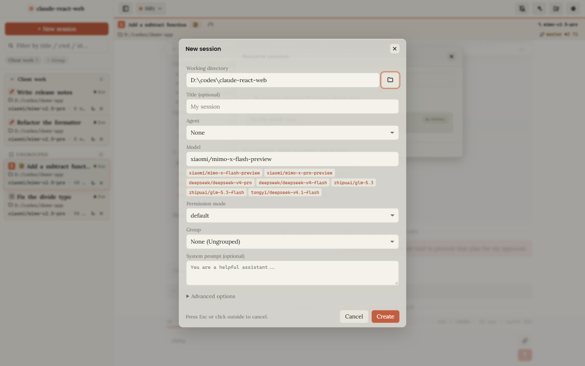

| 字段 | 说明 |
| --- | --- |
| `Project` | 最近项目下拉框，默认预选上次使用的项目；`Open project…` 打开目录选择器，也可在搜索框直接粘贴绝对路径 |
| `Title (optional)` | 标题；不填就用默认编号 |
| `Agent` | 用某个自定义 Agent 当主线程（`None` 表示不用） |
| `Model` | 模型，可点最近使用的芯片 |
| `Permission mode` | 见 [第 5 章](#5-权限与安全) |
| `Group` | 放进哪个分组；满了的分组会标注 ` — will replace oldest` |
| `Accent colour` | 该会话的强调色（品牌皮肤下隐藏） |
| `System prompt (optional)` | 系统提示词 |

展开 **`Advanced options`** 还有：`Effort`、`Thinking`（`adaptive`/`enabled`/`disabled` + `Thinking budget (tokens)`）、`Max turns`、`Max budget (USD)`、`Fallback model`、`Additional directories`、`Allowed tools`、`Disallowed tools`、`Tools`、`MCP servers`、`First-party tools`、`Plugins`、`Session MCP overrides (JSON)`、`Environment variables`。

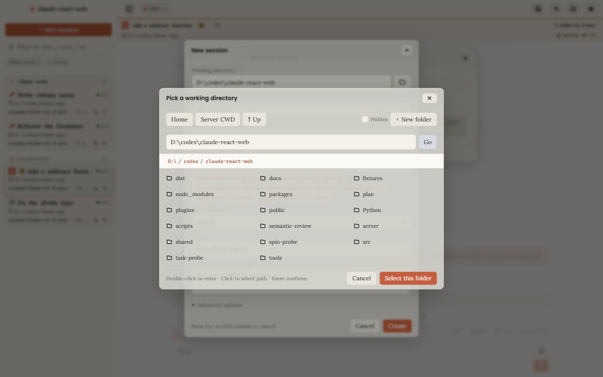

目录选择器是**只列目录**的轻量浏览器：`Home` / `Server CWD` / `↑ Up` / `Hidden` / `+ New folder`，双击进目录，单击选中，`Enter` 确认，`Select this folder` 落定。

### 2.2 分组

- 点 `+ Group` 输入名字回车即可建组；右键分组胶囊可 `Rename group…` / `Delete group`（**删组不会删会话**）。
- 会话右键 → `Move to group ▸ <分组名>` 把会话挪进分组。
- 分组胶囊可拖动排序；折叠状态会被记住。

### 2.3 搜索会话内的消息

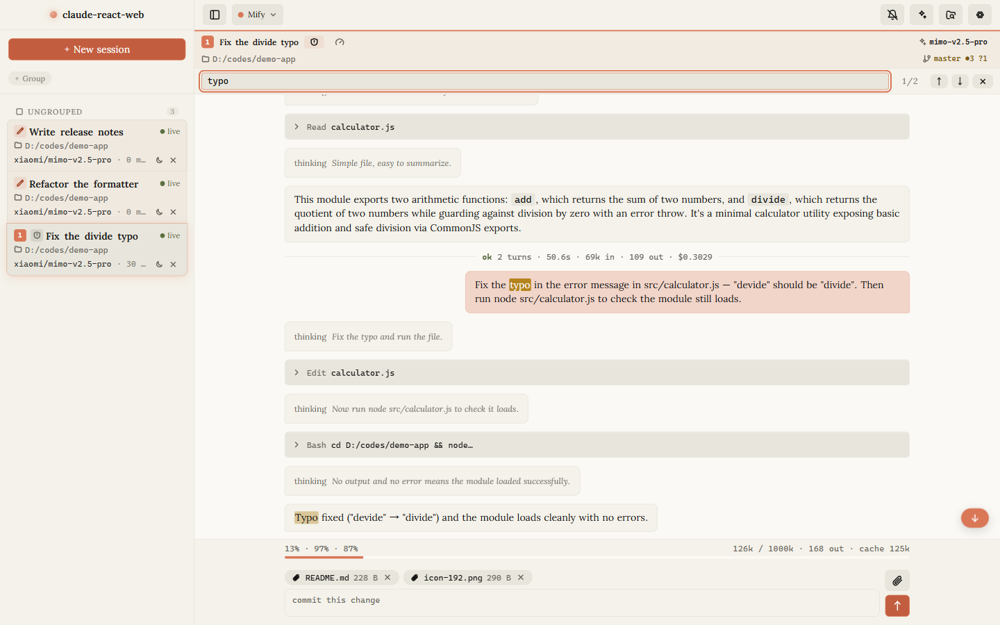

在面板里按 `Ctrl+F`（或右键 → `Search messages`）打开搜索条：输入即高亮，`Enter`/`↓` 下一个、`Shift+Enter`/`↑` 上一个，右侧显示 `n/total` 命中数，`Esc` 关闭。

---

## 3. 对话与消息

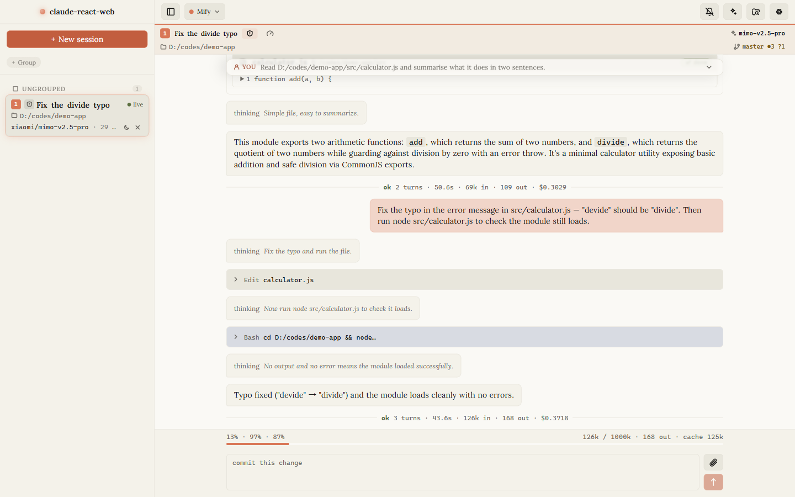

一轮完整对话长这样：用户气泡 → `thinking` 折叠块 → 工具卡片（`Read`/`Edit`/`Bash`…）→ 助手回答 → 一行统计（`ok 3 turns · 43.6s · 126k in · 168 out · $0.3718`）。

底部常驻**上下文条**：`13% · 97% · 87%` 三个数字分别是已用比例、自动压缩阈值、以及距阈值还剩多少，右侧是 `126k / 1000k · 168 out · cache 125k`。阈值标记可以**拖动**调整，双击恢复自动。

### 3.1 正在生成时的状态

输入框上方会出现工作条，按阶段显示：

| 文案 | 含义 |
| --- | --- |
| `Thinking...` / `Writing...` / `Calling <工具名>...` | 思考 / 写回答 / 调工具三态 |
| `Recap (auto)...` | 正在自动压缩上下文 |
| `Waiting...` | 回合已结束，但后台子代理还在跑（任务仍留在 Tasks 面板里） |
| 旁边的小标签 | 已用时长、`N tok/s`、`~N tok` 思考估算、任务数胶囊、子代理胶囊 |

### 3.2 工具卡片

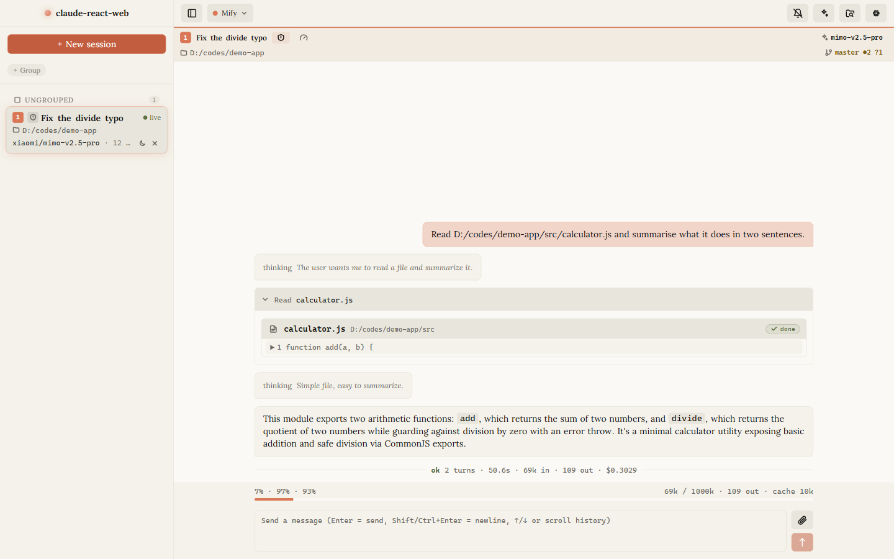

点卡片标题栏展开/收起。不同类型的工具各有专用视图（`BashToolView`、`ReadToolView`、`GrepToolView`、`Edit` 的差异视图、`TodoWriteView`……）。连续多个工具调用会折叠成一个**工具组卡片**（可在设置里关掉）。文件类卡片右上角可以直接 `View file content`、`Stage`、`Discard`。

### 3.3 消息上的右键菜单

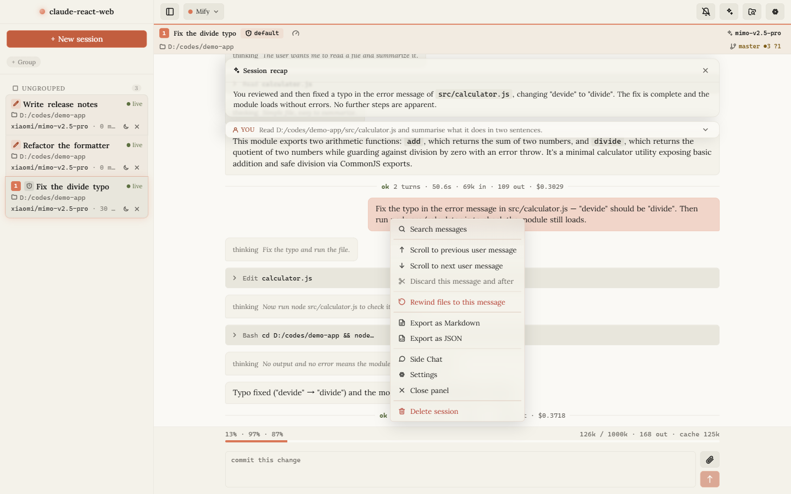

在消息区右键（选中文本时还会多出 `Copy` 与插件贡献的条目）：

| 条目 | 作用 |
| --- | --- |
| `Search messages` | 打开搜索条 |
| `Scroll to previous / next user message` | 在用户提问之间跳转 |
| `Discard this message and after` | **丢弃**这条及之后的对话（可选 `Also delete the original conversation (irreversible)`） |
| `Rewind files to this message` | **回退文件**到这条消息时的状态（先给 dry-run 差异预览） |
| `Export as Markdown` / `Export as JSON` | 导出整个会话 |
| `Side Chat` | 开侧边小窗聊，不污染主对话 |
| `Settings` | 打开该会话的设置面板 |
| `Close panel` / `Remove from "分组"` / `Close all panels in "分组"` | 关面板 |
| `Delete session` | 删除会话（会二次确认） |

### 3.4 Recap（会话回顾）

会话空闲一段时间后会自动生成回顾（可在设置里关掉 `Auto-generate session recap`）。它以浮层出现在面板顶部，标题 `Session recap`；手动刷新按 `Alt+R`，或在输入框右键选 `Generate recap`。

---

## 4. 输入、附件与命令

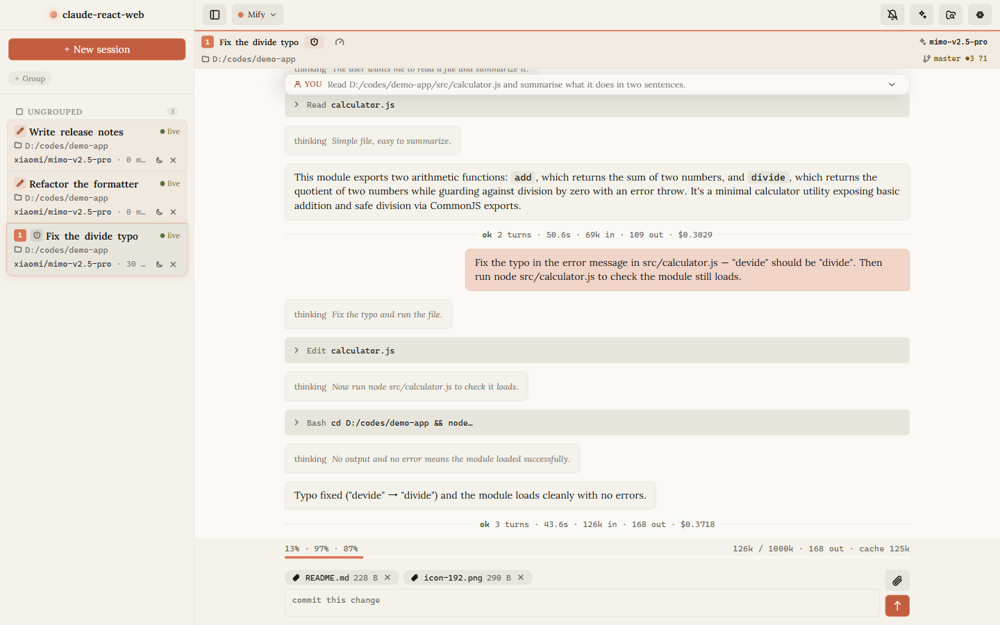

输入框（`Message input`）是富文本编辑器：

| 操作 | 方式 |
| --- | --- |
| 发送 | `Enter` |
| 换行 | `Shift+Enter` 或 `Ctrl+Enter` |
| 附件 | 点回形针，或**直接拖文件进来**，或把截图粘进去 |
| 长文本 | 粘贴大段文本会折叠成 `[Pasted text #N]` 引用，正文存在浏览器里 |
| 展开大编辑区 | `Alt+Enter`（带 `Edit` / `Preview` 两个页签） |
| 历史输入 | `↑` / `↓`（光标在首/末行时）、滚轮、或 `Ctrl+Shift+H` 开面板 |
| 接受提示建议 | 空闲时输入框会浮出预测的下一句，按 `Tab` 采用 |

### 4.1 斜杠命令

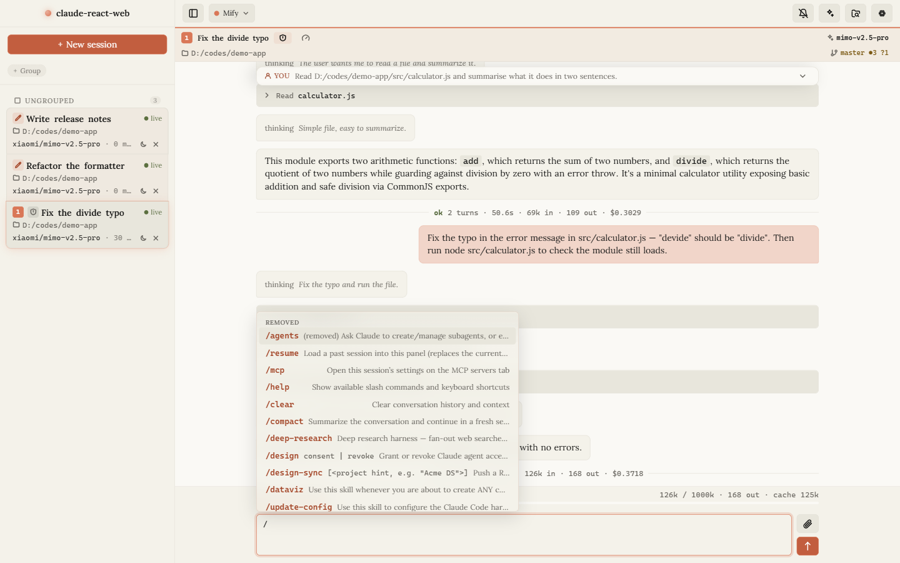

输入 `/` 弹出命令面板（↑↓ 选择、`Enter`/`Tab` 确认、`Esc` 关闭）。内置命令：

| 命令 | 作用 |
| --- | --- |
| `/clear` | 清空对话历史与上下文 |
| `/compact` | 总结当前对话并从摘要继续 |
| `/resume` | 把历史会话载入当前面板 |
| `/mcp` | 打开本会话的 MCP 设置 |
| `/agents` | 创建/管理子代理（由 CLI 提供，不是 App 本地命令） |
| `/help` | 显示斜杠命令与快捷键 |

其余条目来自你安装的**技能/插件**（截图中的 `/deep-research`、`/design`、`/design-sync`、`/dataviz`、`/update-config` 就是技能自带的）。

### 4.2 bash 模式

在输入框开头敲 `!` 会切成 **bash 模式**，这条命令在会话的工作目录里直接执行、**不发给模型**；`!!` 表示本地执行**并把输出也发给模型**。输入框左侧会显示 `!` / `!!` 徽标。

### 4.3 代码片段（snippets）

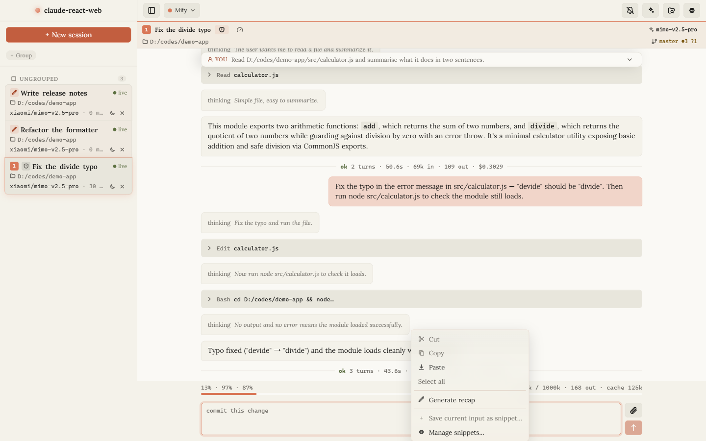

在输入框里右键：`Cut` / `Copy` / `Paste` / `Select all`，然后是 `Generate recap`、**你保存的每个片段**、`Save current input as snippet…`、`Manage snippets…`。

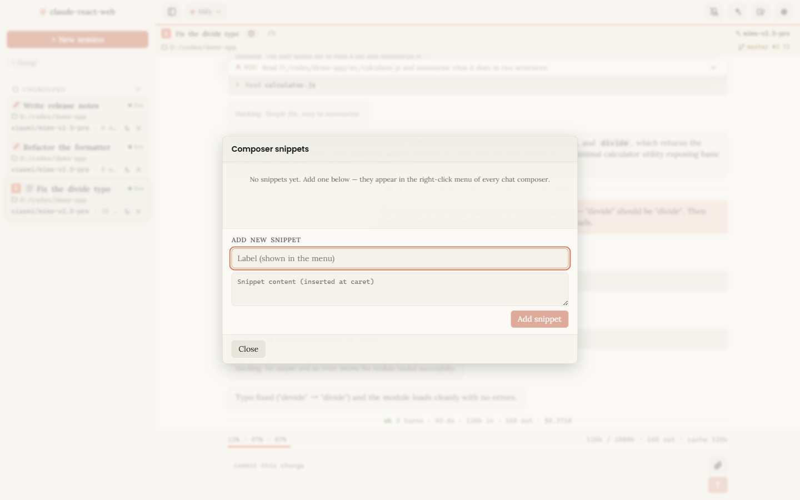

`Composer snippets` 对话框里可以新增、编辑、上下排序、删除片段；片段会出现在**每个**会话输入框的右键菜单里。

### 4.4 切模型

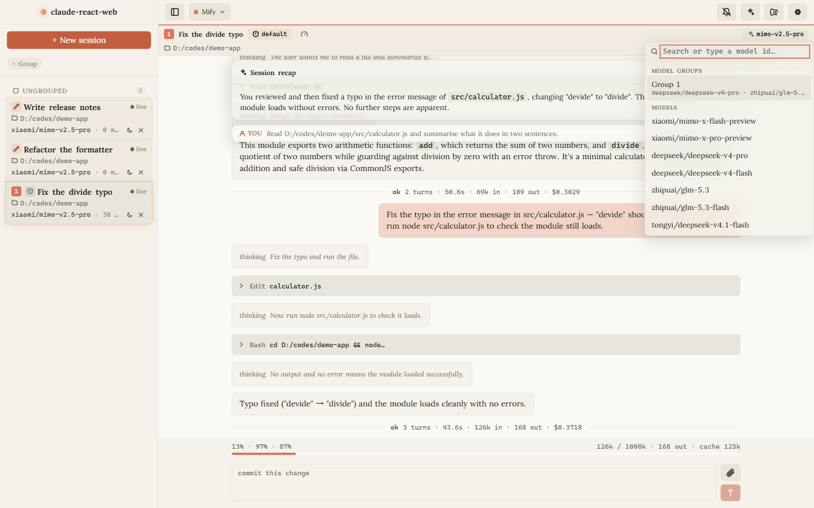

点面板头部的模型胶囊（或按 `Ctrl+K` 搜模型）。选择器分三段：**Model Groups**（配置档里定义的 opus/sonnet/haiku 映射组）、**Recent**（最近用过）、**Models**（可用列表），也可以直接输入任意模型 id —— 会显示成 `Use “你输入的内容”`。

### 4.5 上传文件管理

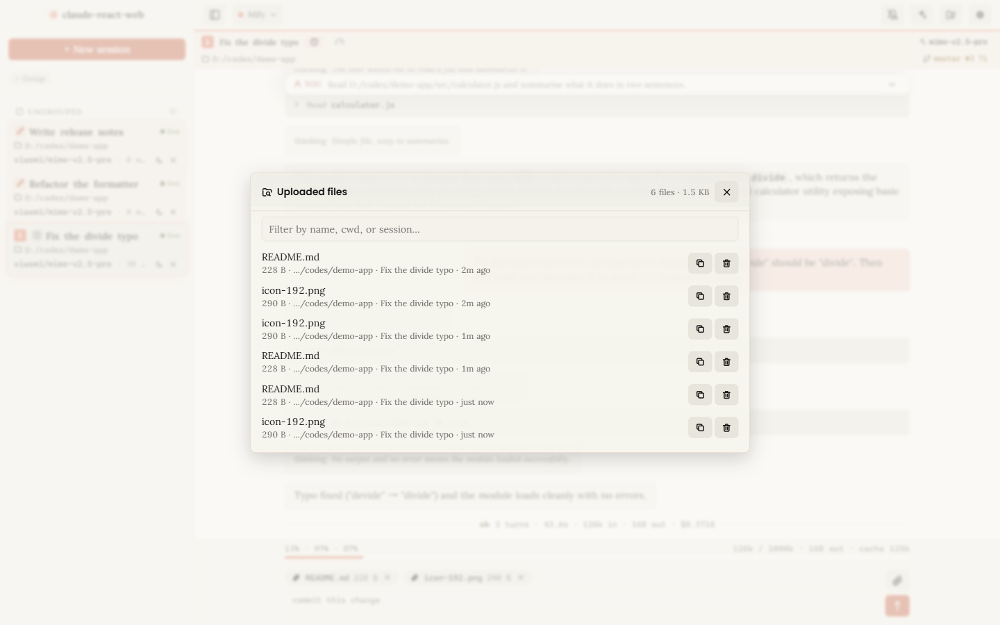

点工具栏的 `Uploaded files` 按钮，可以看到所有上传记录：`N files · 总大小`、按名字/目录/会话过滤、`Copy path`、`Delete file`，以及 `Clean missing entries` 清理已失效的条目。

---

## 5. 权限与安全

### 5.1 权限模式

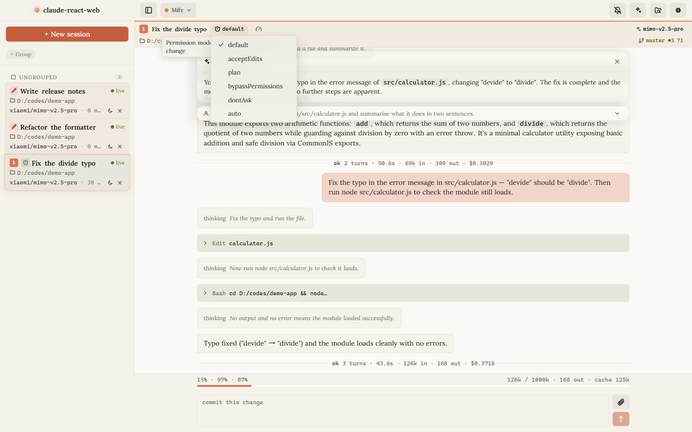

点面板头部的模式胶囊切换，或按 `Shift+Tab` 循环。界面里显示的是原始模式名，友好名如下：

| 原始名 | 界面友好名 | 行为 |
| --- | --- | --- |
| `default` | Default (ask) | 每次用工具都问你 |
| `plan` | Plan mode | 只出计划，批准后才动手 |
| `acceptEdits` | Auto-accept edits | 文件编辑自动放行，其他工具仍问 |
| `bypassPermissions` | Bypass permissions | 全部跳过（慎用） |
| `dontAsk` | Don't ask | 未预授权的直接拒绝，不打扰你 |
| `auto` | Autonomous | 自主执行 |

> 读**工作目录以内**的文件通常自动放行；读目录之外的路径会弹权限确认。

### 5.2 工具权限弹窗

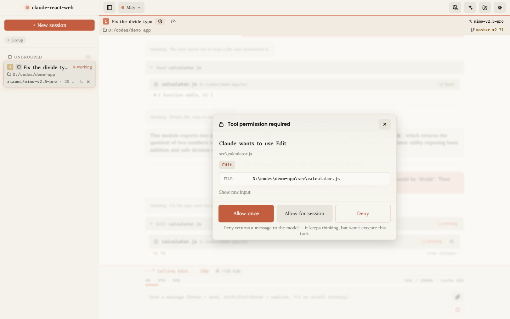

三个按钮：

| 按钮 | 作用 |
| --- | --- |
| `Allow once` | 只放行这一次 |
| `Allow for session` | 按 SDK 建议的规则，**本会话**内一直放行（仅当 SDK 提供了建议时出现） |
| `Deny` | 拒绝 |

`Show raw input` / `Hide raw input` 可以看模型传给工具的原始参数。提示写着：`Deny returns a message to the model — it keeps thinking, but won't execute this tool.` —— 拒绝**不会**中断整轮，模型会换个思路继续。按 `Esc` 等于软拒绝。

### 5.3 计划模式审批

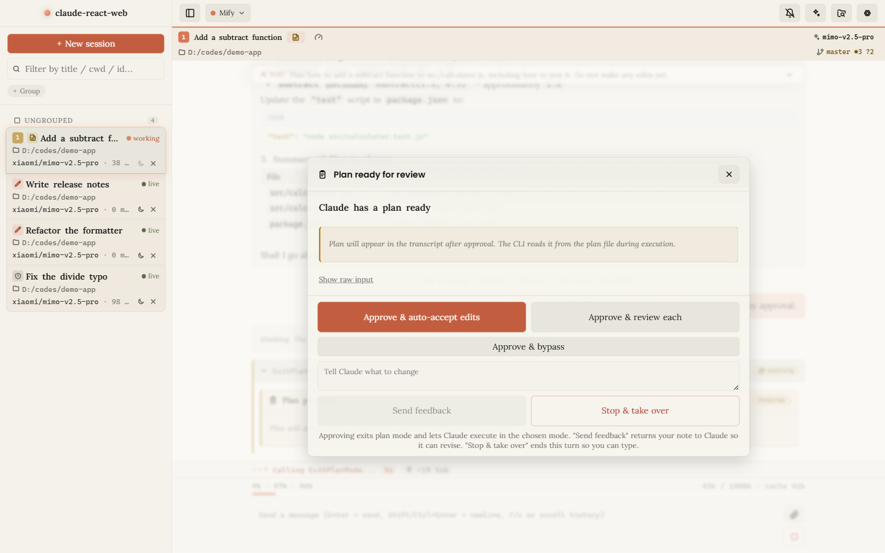

在 `plan` 模式下，模型给出计划后会弹出审批框（`Claude has a plan ready`）：

| 按钮 | 作用 |
| --- | --- |
| `Approve & auto-accept edits` | 批准，之后自动接受文件编辑 |
| `Approve & review each` | 批准，但每个动作仍逐个确认 |
| `Approve & bypass` | 批准并跳过所有权限提示 |
| `Send feedback` | 把你在 `Tell Claude what to change` 里写的话退回给模型，**继续在本轮里**改计划 |
| `Stop & take over` | 中止本轮，把输入框交还给你 |

### 5.4 沙箱与允许规则

会话设置的 `General` 标签里有沙箱开关组（`Run commands in a sandbox`、`Auto-allow sandboxed commands`、`Allow unsandboxed fallback`、`Fail hard if unavailable`），展开 `Advanced (network / filesystem overrides)` 还能填 `Allowed network domains` 与 `Extra writable paths`。同一标签的 `FlagSettingsEditor` 可以编辑 `Permissions`（默认模式、`Allow rules`、`Deny rules`）、`Env`、`Raw JSON`，改完点 `Apply settings`。

---

## 6. 后台任务与子代理

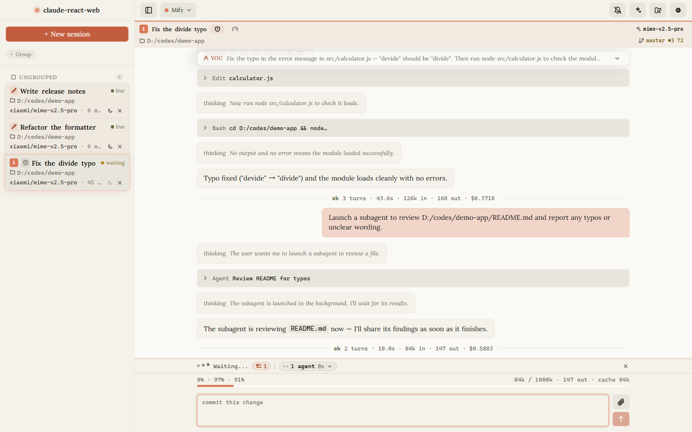

模型派发子代理（`Agent`）时，对话里会出现 `Agent <描述>` 卡片，展开能看到 `SUBAGENT <描述>` 行。同时底部工作条右侧出现两个胶囊：

- **任务胶囊**（`IconListTodo` + 数量）：点击打开 Tasks 面板；
- **子代理胶囊**（如 `1 agent 8s`）：点击弹出浮层，逐个列出在飞的子代理、进度摘要、最后调用的工具与耗时，点一行可钻进它的完整对话。

**把前台任务扔到后台**：按 `Alt+B`（等价于 CLI 的 Ctrl+B）。后台任务在回合结束后仍在运行时，横幅显示 `Waiting...`，此时会话状态徽标也变成 `waiting`。

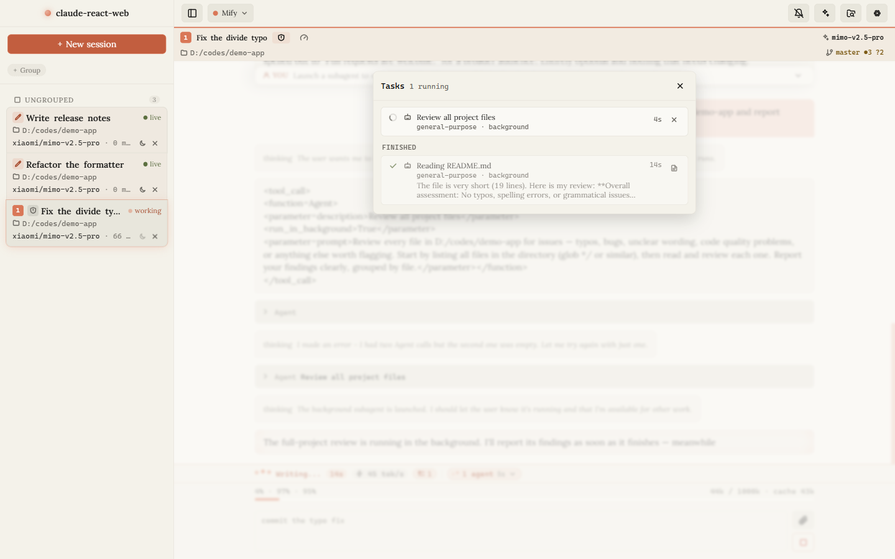

Tasks 面板分两组：正在跑的（带 `Stop <描述>` 停止按钮）和 `FINISHED`（带进度摘要与 `View subagent transcript` 看落盘记录）。`Workflow` 工具调用会渲染成独立的 `WorkflowCard`。

---

## 7. Git 集成

面板头部的 Git 胶囊显示 `分支 ●暂存 ?未跟踪` 之类的摘要，悬停有完整信息，点击打开 Git 面板。

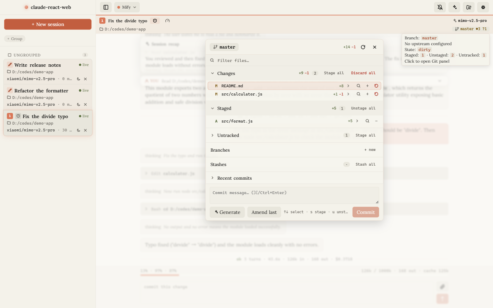

面板按段落组织：

| 段落 | 操作 |
| --- | --- |
| `Changes` | `Stage all`、`Discard all`；每行可 `View file content` / `Stage` / `Discard changes` |
| `Staged` | `Unstage all`；每行 `Unstage` |
| `Untracked` | `Stage all`；每行还能 `Delete from disk`（会二次确认，**删了不可恢复**） |
| `Branches` | `+ new` 建分支并切换；点分支名切换（有冲突时提示 `Auto-stash & switch`） |
| `Stashes` | `Stash all`；每条可 `pop` / `drop` |
| `Recent commits` | 最近提交列表 |

顶部还有 `Pull (fast-forward only)`、`Push to remote`、`Refresh`，以及进行中的 merge/rebase 横幅（`Abort merge` / `Abort rebase`）。

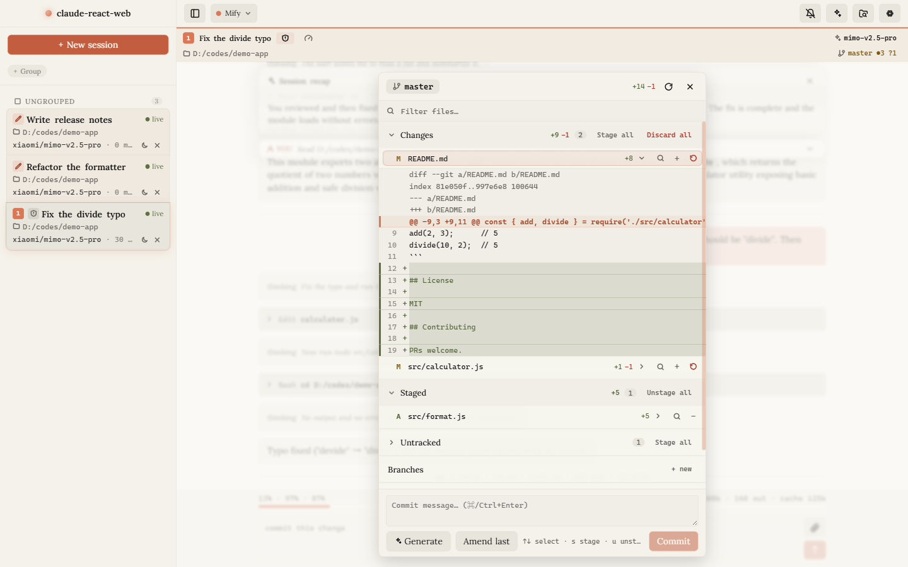

点文件行展开差异视图（新增绿、删除红）。

**提交栏**在面板底部：写 `Commit message… (⌘/Ctrl+Enter)`、点 `Generate` 让 AI 依据**已暂存的差异**生成提交信息、`Amend last` 修正上一次提交、`Commit` 提交。面板主体支持键盘：`↑↓` 选择、`s` 暂存、`u` 取消暂存、`x` 丢弃、`Enter` 展开差异。

**回退文件**：在对话里右键某条用户消息 → `Rewind files to this message`，会先弹出 dry-run 差异预览，确认后才真正恢复文件（与"丢弃对话"是两个独立功能，可以组合使用）。

---

## 8. 扩展：MCP、插件、Agent、技能、Hooks

这一章的东西分两类，先分清：

- **Claude 插件市场 / MCP** → 扩展**模型**的能力（给它加工具、加服务器）；
- **App 插件（Mods）** → 扩展**应用外壳**（加菜单、命令、设置页、面板）。

### 8.1 MCP 服务器

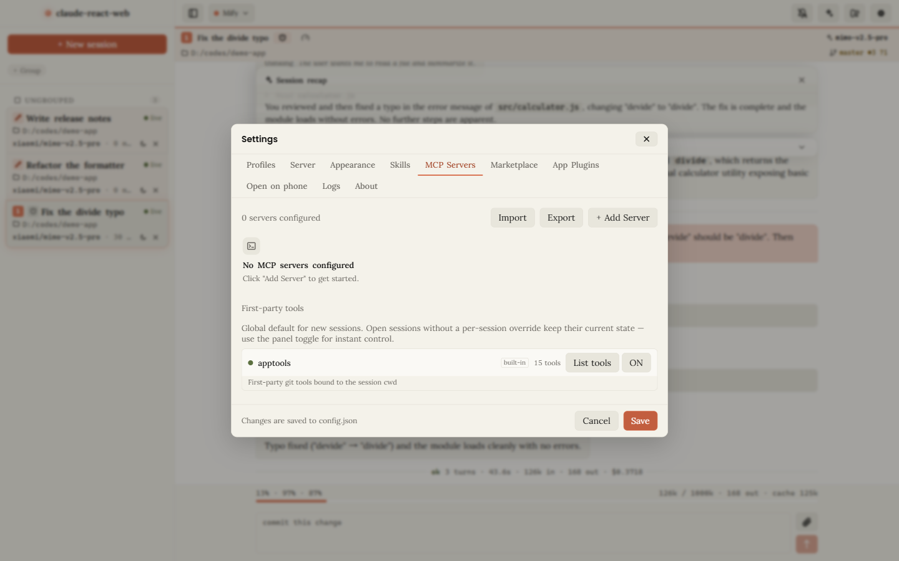

**全局配置**在 全局设置 → `MCP Servers`：`Import` / `Export` / `+ Add Server`。每个服务器卡片可以：

| 按钮 | 作用 |
| --- | --- |
| `Test` | 试连，结果显示 `Connected` / `Auth required` / `Connection failed` |
| `List tools` | 列出该服务器提供的工具（带 `read-only` / `destructive` / `open-world` 标签） |
| `Auth` / `Re-auth` / `Clear auth` | 远程服务器的 OAuth 授权 |
| `ON` / `OFF` | 启用/停用 |
| `Edit` / `Del` | 编辑/删除 |

导出的开关 `Include secret values (env/headers)` 记得注意：勾选后密钥会被写出，不勾则留空由你在目标机器上重填。

**会话级**控制在 会话设置 → `MCP Servers`（见 [9.1](#91-会话设置)）：可以临时 `Reconnect`、`Disable`/`Enable`，也能从全局配置里挑服务器 `Add` 进当前会话。远程服务器需要授权时，对话区会弹出授权框（`MCP authorization`），点 `I've completed authorization` 确认。

### 8.2 Claude 插件市场

全局设置 → `Marketplace`：粘贴一个公开 https 的 git 仓库地址（如 `https://github.com/owner/repo`）和可选 ref，`Add` 拉取目录；每个插件有 `ON`/`OFF` 开关，市场卡片支持 `Refresh`、`Update all`、`Del`。

### 8.3 App 插件（Mods）

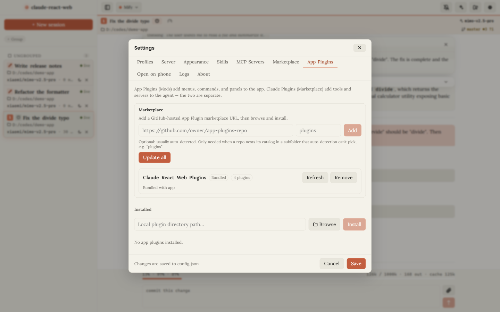

全局设置 → `App Plugins`。安装有两条路：

- **市场**：填 GitHub 仓库地址（+ 可选子目录）→ `Add` → 展开市场行 → 逐插件 `Install`；
- **本地目录**：直接把路径粘到 `Local plugin directory path…` → `Install`（或 `Browse` 选目录）。

装好之后每行有 `Disable`/`Enable`、`Uninstall`；展开还能看到三块：

| 区块 | 内容 |
| --- | --- |
| 权限 | 逐个权限码的勾选框（如 `network.fetch — host1, host2`），改完 `Save permissions` |
| 配置 | 插件声明的设置项（布尔/数字/枚举/数组/字符串），`Save settings` |
| 贡献项 | 插件到底加了什么：`command: …`、`menu: … @ 位置`、`action: …` |

> ⚠️ 信任模型：App 插件的后台代码是**受信任的本地程序**（能 `import node:fs`），权限勾选是**征得同意 + 功能开关**，不是沙箱。只装你信得过的插件。
>
> 每个已安装插件都带一个状态徽标（`active` / `quarantined` / `crashed` / `permission-required` / `incompatible` / `corrupted`），崩溃或被隔离的插件就显示为对应状态。启动参数 `--disable-app-plugins` 和 `--safe-mode` 可以整体关掉或只保留静态 UI。

### 8.4 自定义 Agent

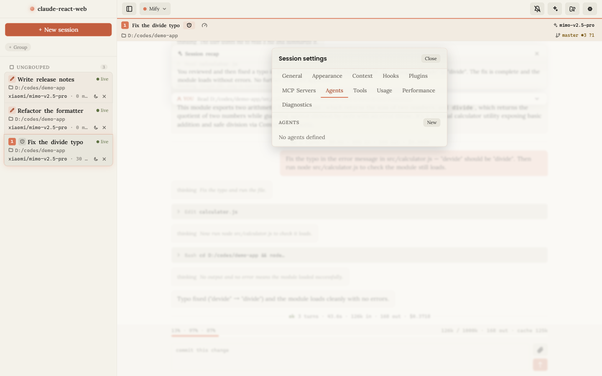

会话设置 → `Agents`：`New` 新建一个自定义代理，字段包括 `Name`、`Description`、`Prompt`、`Tools`/`Disallowed tools`/`MCP servers`/`Skills`、`Model`、`Effort`、`Permission mode`、`Max turns`、`Background`、`Memory`、`Initial message`，以及高级的 `Observer` 相关项。建好后可以在新建会话的 `Agent` 字段里选它当主线程，或在面板头部的 `Persona` 胶囊里随时切换。

### 8.5 技能（Skills）

全局设置 → `Skills` 管理技能的加载方式（`Session Skill Loading`：`SDK default` / `Enable all discovered skills` / `Enable selected skills only`），可以从文件夹安装技能（`Install from folder`，选 `Project` 或 `User` 作用域），也能预览每个技能的内容。**会话级**策略在 会话设置 → `Context` 的 `Session skill policy` 卡片里。

### 8.6 Hooks

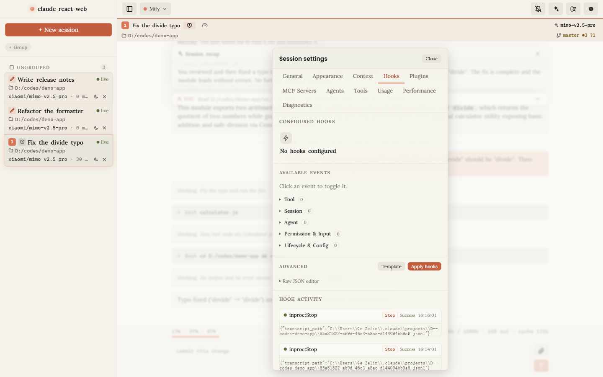

会话设置 → `Hooks`：`Available Events` 里按分类（Tool / Session / Agent / Permission & Input / Lifecycle & Config）勾选要挂的事件，`Configured Hooks` 里维护每个 matcher 的命令/URL/提示词/超时，`Apply changes` 生效。`Hook Activity` 会实时显示每次 hook 运行的状态与输出，是排查 hook 问题的地方。

---

## 9. 设置

**两个入口，别搞混**：

| 入口 | 打开方式 | 作用范围 |
| --- | --- | --- |
| **会话设置** | 在面板里右键 → `Settings`（或 `/mcp`） | 只影响**这一个会话**（部分字段立即可用） |
| **全局设置** | 工具栏齿轮 `Global Settings`（或配置档菜单里的 `Manage profiles…`） | 写进 `config.json`，点 `Save` 才对所有会话生效 |

### 9.1 会话设置

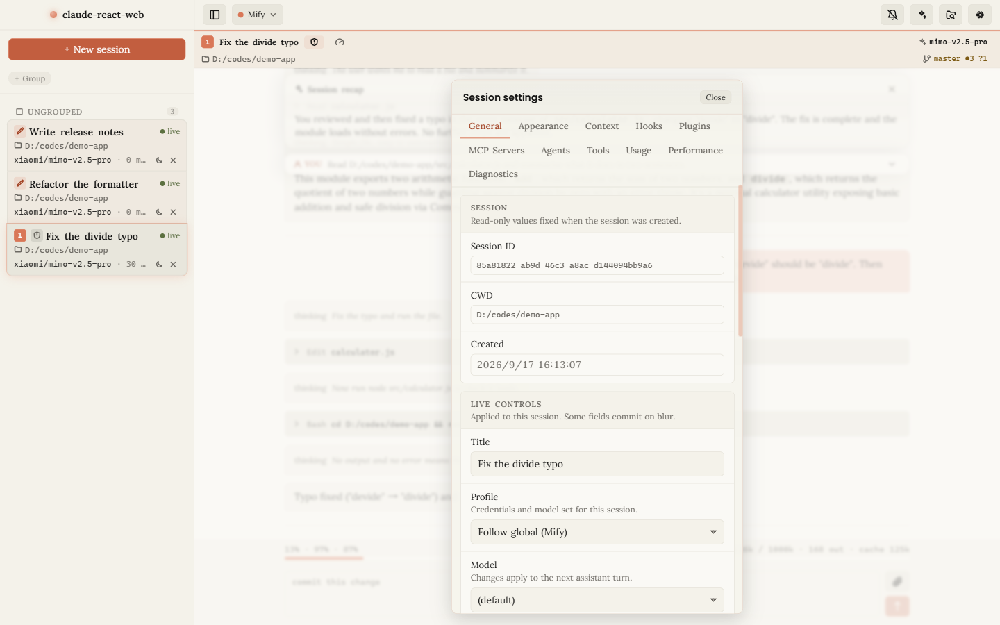

标签页依次是：`General` · `Appearance` · `Context` · `Hooks` · `Plugins` · `MCP Servers` · `Agents` · `Tools` · `Usage` · `Performance` · `Diagnostics`。

- **General**：只读的 `Session ID` / `CWD` / `Created`；可改的 `Title`、`Profile`、`Model`、`Permission mode`、`Apply settings`（FlagSettings，见 5.4）；`Memory` 组（`Auto-memory`、`Memory directory`、`Background memory consolidation`）；`Sandbox` 组。
- **Appearance**：四个开关的**本会话覆盖**（`Show pinned "current question" header`、`Auto-generate session recap`、`Use collapsible tool-group cards`、`Show message card headers`），旁边有 `Reset (inherit global)`。
- **Context**：`Context usage` 上下文条、`Auto-compact window`、技能/代理占用明细。
- **Plugins**：本会话加载的插件，`Reload plugins`、逐个 `Disable`/`Enable`，以及 `Browse plugins` 打开市场。
- **MCP Servers**：见 [8.1](#81-mcp-服务器)。
- **Agents / Hooks / Tools**：见 [8.4](#84-自定义-agent)、[8.6](#86-hooks)。

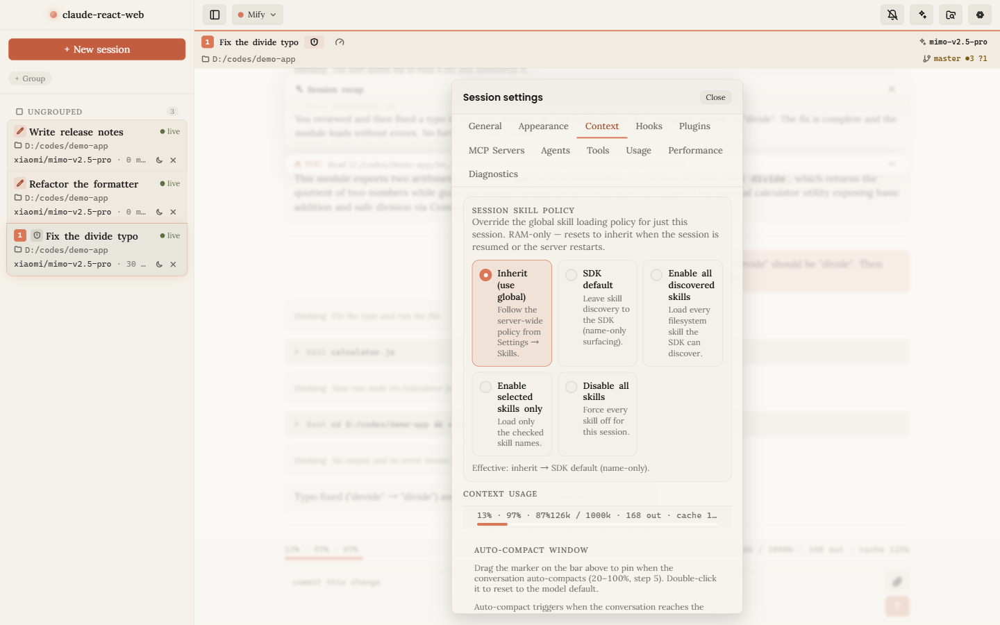

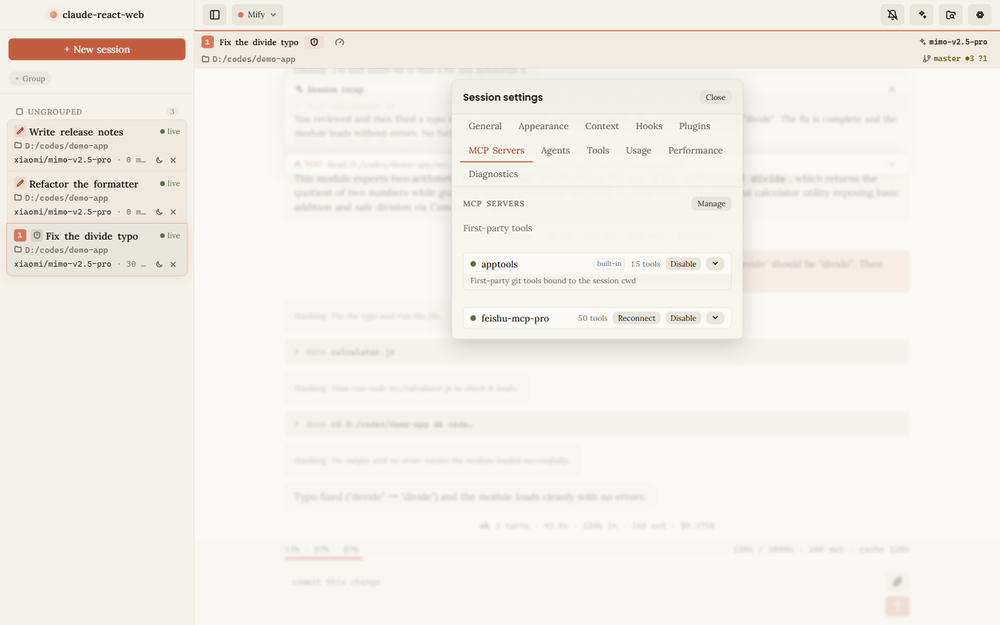

### 9.2 全局设置

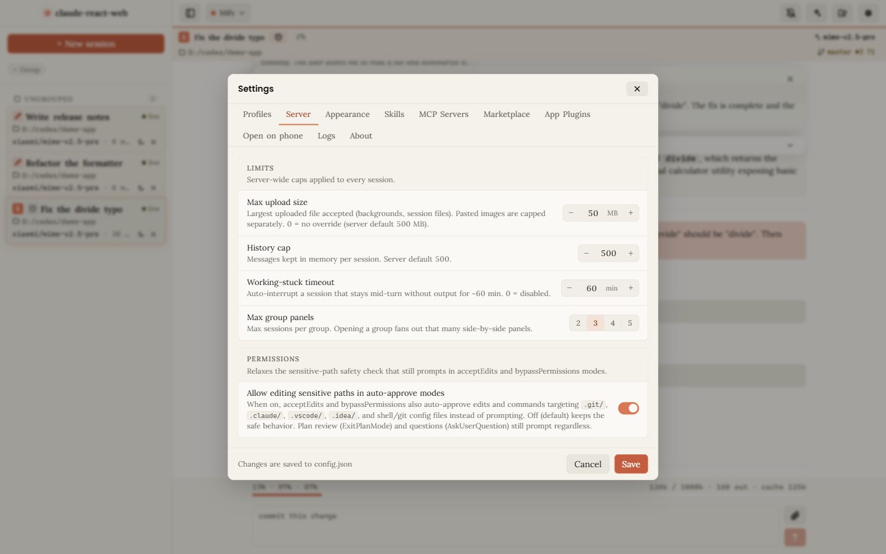

标签页：`Profiles` · `Server` · `Appearance` · `Skills` · `MCP Servers` · `Marketplace` · `App Plugins` · `Open on phone` · `Logs` · `About`。底部提示 `Changes are saved to config.json`，点 `Save` 落盘。

- **Server**：`Max upload size`、`History cap`、`Working-stuck timeout`、`Max group panels`（2–5，即最多几个会话并排）、`Allow editing sensitive paths in auto-approve modes`。
- **Appearance**：默认值（置顶当前问题、自动 recap、工具组卡片、消息卡头）以及 `Transcript spacing`、`Message text density`、`Font size` 三档密度。
- **Logs**：`Level`（error/warn/info/debug/trace）、`Scope filter`、`Log to file` 开关。注意级别/范围改动**立即生效但不持久**。

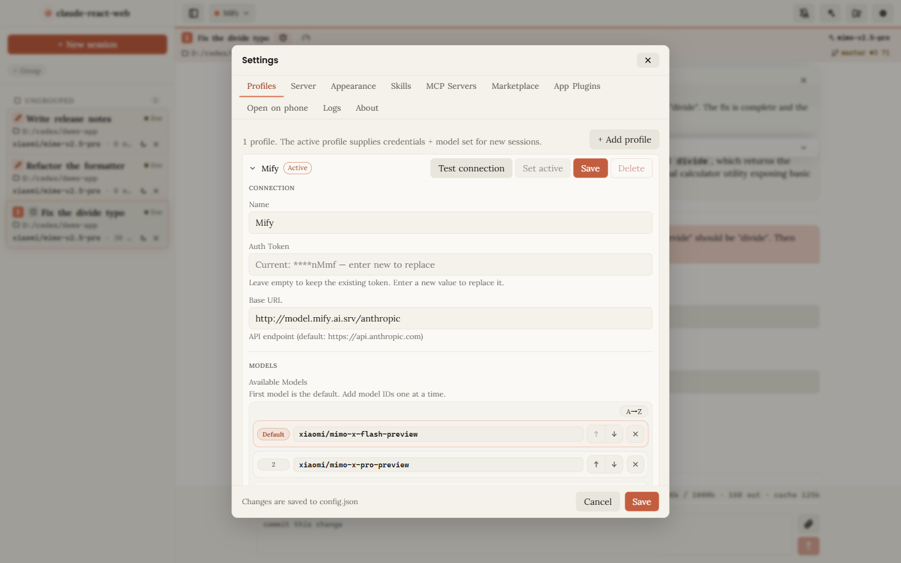

**Profiles（配置档）** 是凭据与模型集的组合：`+ Add profile` 新建，每个卡片里有 `Connection`（`Name`、`Auth Token`、`Base URL`）、`Models`（`Available Models` 列表、`Recap Model`、`Commit Message Model`）、`Model Groups`（把 opus/sonnet/haiku 三个槽位映射到具体模型，并选 `Main`）。`Recap Model` / `Commit Message Model` 保持 `(default)` 表示「用会话的辅助模型」——会话有活动的 Model Group 时用该组的 **haiku** 档，否则用会话自己的模型；想覆盖就在这两个下拉框里显式选一个。右上角 `Test connection` 可试连，`Set active` 设为活动配置档。

工具栏左上角的配置档切换器选另一个配置档时，会弹出 `Switch profile to "..."` 询问要把哪些**在线会话**一起重启过去 —— 只有被勾选的会话会重启。

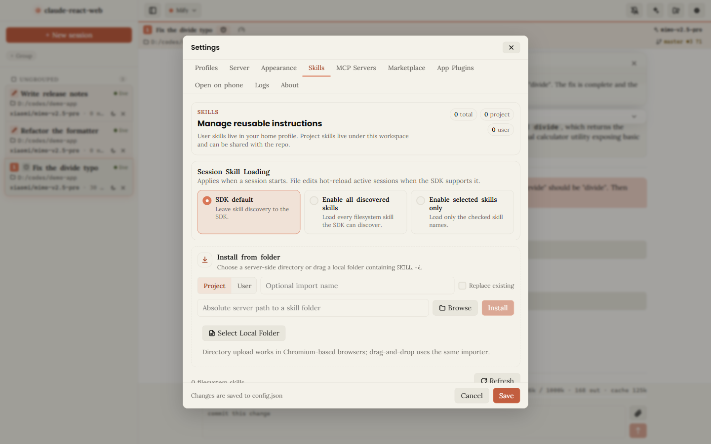

### 9.3 外观

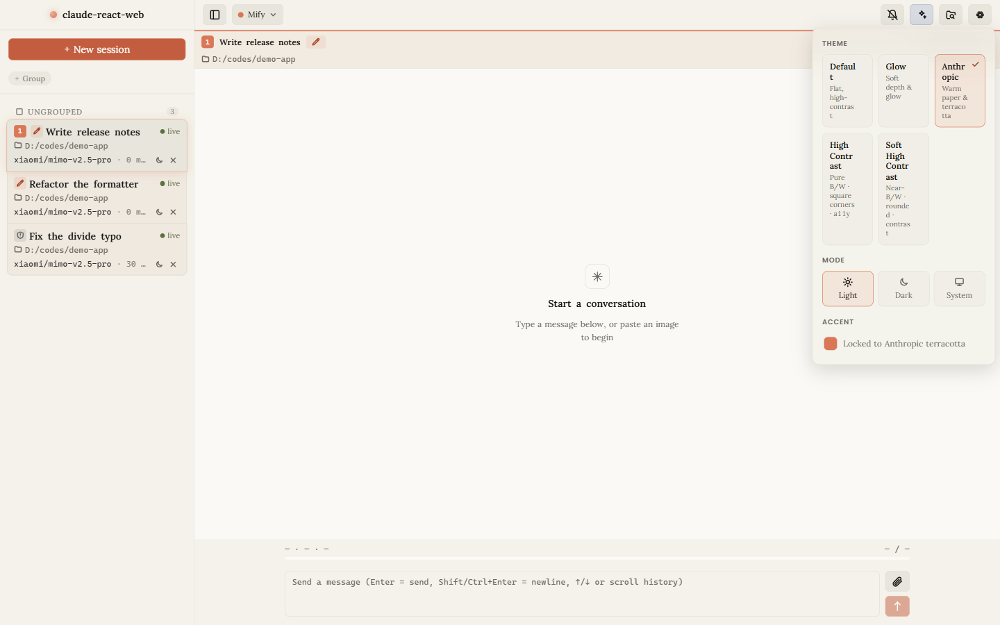

工具栏的 `Theme` 按钮打开外观弹层：

- **Theme（皮肤）**：`Default`（扁平高对比）、`Glow`（柔和发光）、`Anthropic`（暖纸+赤陶色）、`High Contrast`（纯黑白、直角、无障碍）、`Soft High Contrast`；
- **Mode**：`Light` / `Dark` / `System`；
- **Accent**：强调色色板（Anthropic / 高对比 / 柔和高对比三种皮肤会锁色，显示 `Locked to Anthropic terracotta` 之类）；
- **Background**：仅部分皮肤可用，支持 `None`/`Image`/`Video`、URL 或本地上传，并带 `Opacity` / `Blur` / `Content` 三个滑杆。

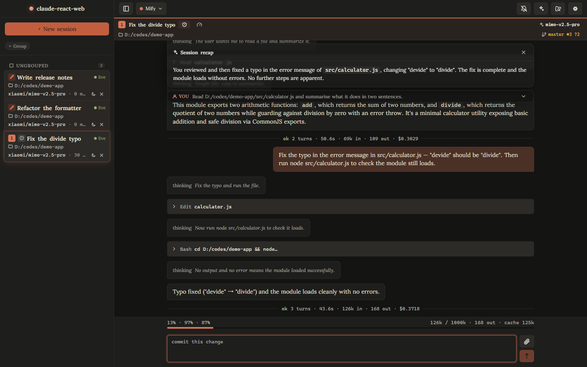

同一个界面的深色模式（本手册主要为浅色，因为项目 README 的主图也是浅色）。

### 9.4 用量、性能与诊断

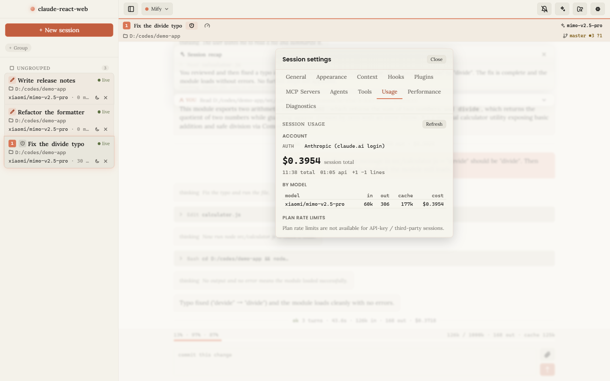

- **Usage**（会话设置 → `Usage`）：`Account`（`email` / `org` / `plan` / `auth`）、本会话总花费、`By model` 表格（`in` / `out` / `cache` / `cost`）、以及 claude.ai 套餐的 `Plan rate limits` 窗口条。仅对**在线会话**可用。
- **Performance**（会话设置 → `Performance`）：`Overview` / `Event loop` / `WebSocket` / `HTTP` / `Sessions` 五组指标表，列 `series / count / p50 / p95 / p99 / max`，并带迷你走势图与分布条。

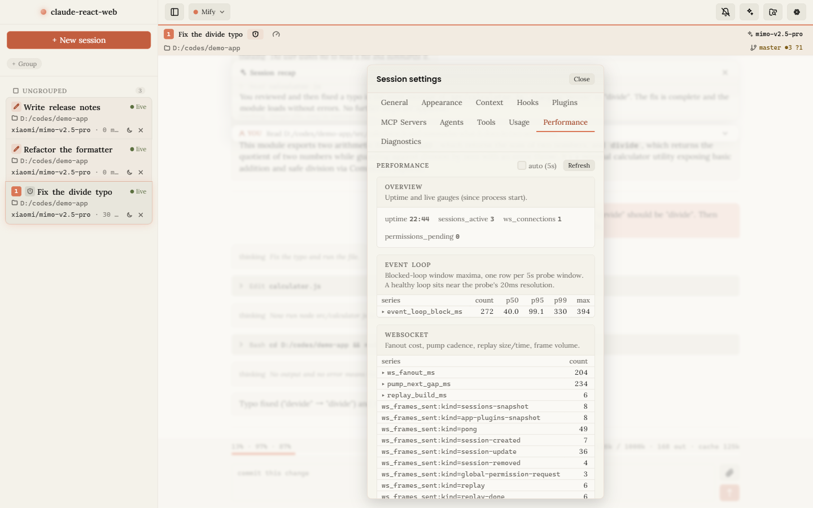

- **Diagnostics**：`CLI debugging` 的 `CLI debug logging`（`Global ({on|off})` / `On` / `Off`）、`Process output` 的 `stderr tail`、`Debug log` 的日志路径与大小。

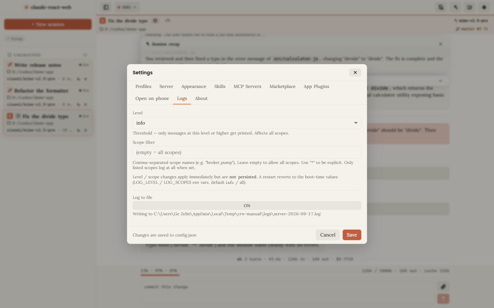

### 9.5 About 与更新

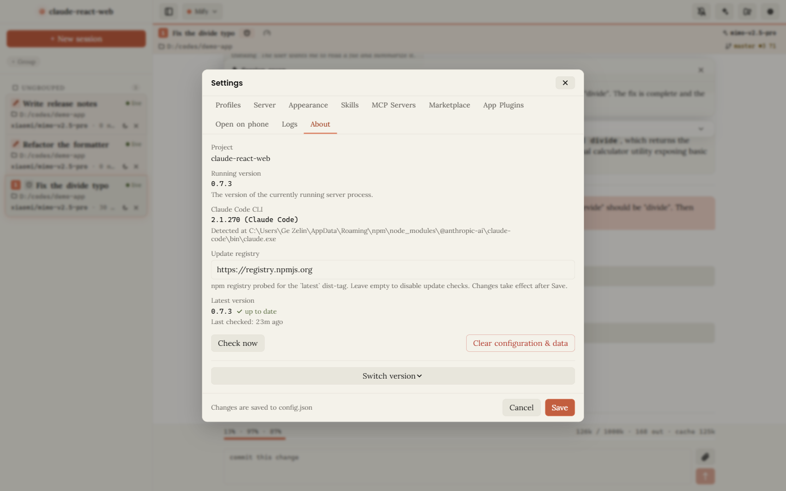

`About` 页显示 `Project`、`Source`、`Running version`、`Release notes`（`What's new in {版本}`）、`Claude Code CLI` 检测结果、`Agent SDK` 版本、`Update registry`、`Latest version`，以及 `Check now` / `Update now` / `Clear configuration & data`（后者打开一个可勾选的清理对话框；危险项需要输入 `reset` 才能确认）。

### 9.6 只能在配置文件 / 命令行里改的项

界面上改不到的（改 `~/.claude-react-web/config.json` 或命令行）：

| 项 | 说明 |
| --- | --- |
| `accessToken` | 局域网访问令牌。**启动时读取，界面里故意不给改** |
| `subagentHistoryCap` | 子代理历史上限，只在启动时读 |
| `forwardSubagentText` | 是否转发子代理文本，**spawn-time only** —— 只在每个会话的子进程启动时应用，改动需要重启服务端，且只影响之后新建的会话 |
| `logToFile` / `logLevel` | 也能在界面里改（Logs 标签） |
| 侧边栏/面板尺寸等 | 存在浏览器 `localStorage`（如 `claude-react-web:sidebar-min-px`），不在界面里暴露 |

命令行侧还能做：`claude-react-web mcp …`、`marketplace …`、`app-plugin …`、`config get|set`（`authToken` / `accessToken` 永不可写）、`sessions list|delete`、`doctor`、`update`。`--state-dir <路径>` 可以整体换状态目录。

---

## 10. 手机与局域网访问

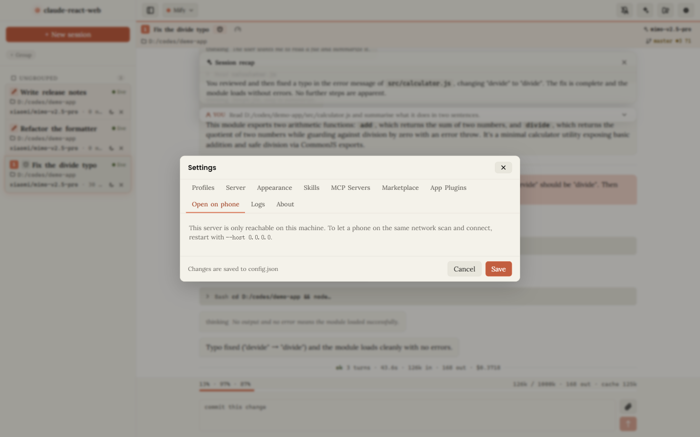

默认只监听 `127.0.0.1`，手机访问不了。要开局域网：

```bash
claude-react-web --host 0.0.0.0
```

此时服务端会**强制要求**一个 web 访问令牌（不给 `--token` 就自动生成），启动时打印带令牌的 URL 和二维码。用手机相机扫码即可直接进入已登录界面。

界面里对应 全局设置 → `Open on phone`：显示二维码、多网卡时可选 `Network address`、`Copy` 复制链接。

> ⚠️ 提示原文：`Anyone on your network with this link gets full access. Keep it private.` —— 同一个网络里拿到这个链接的人拥有完整权限。

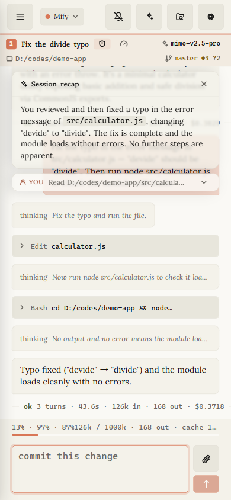

窄屏下界面自动变成单面板 + 抽屉式侧边栏（左上角汉堡按钮 `Open sessions`）。

---

## 11. 快捷键

> 下表按 Windows / Linux 的写法标注 —— macOS 上 `Ctrl` 即 `Cmd`。

### 全局

| 快捷键 | 作用 |
| --- | --- |
| `Ctrl+K` | 命令面板 |
| `Ctrl+B` | 显示/隐藏侧边栏 |
| `Alt+N` | 新建会话 |
| `Alt+W` | 关闭当前面板 |
| `Ctrl+1` / `Ctrl+2` / `Ctrl+3` | 聚焦第 1/2/3 个面板 |
| `Alt+1` … `Alt+9` | 激活第 N 个分组 |
| `Alt+Shift+↑` / `Alt+Shift+↓` | 上移/下移当前分组 |
| `Shift+Tab` | 循环切换权限模式 |
| `Alt+B` | 把本轮任务扔到后台 |
| `Alt+R` | 刷新会话回顾 |
| `Ctrl+Shift+H` | 浏览输入历史 |
| `Ctrl+Shift+O` | 把历史会话恢复进当前面板 |
| `Ctrl+Shift+X` | 结构化输出（`Structured output`）面板 |
| `Ctrl+F` | 在本面板内搜索消息 |
| `Esc` | 关覆盖层 / 中断正在生成的回合 / 空闲时打开 Resume 选择器 |

### 输入框内

| 快捷键 | 作用 |
| --- | --- |
| `Enter` | 发送 |
| `Shift+Enter` / `Ctrl+Enter` | 换行 |
| `Alt+Enter` | 展开大编辑区（Edit / Preview） |
| `↑` / `↓` | 光标在首/末行时翻历史输入 |
| `Ctrl+P` / `Ctrl+N` | 上一条 / 下一条历史 |
| `Tab` | 接受预测的下一句 |
| `/` | 打斜杠命令面板 |
| `Ctrl+A` 后输入 `!` | 进入 bash 模式 |

### Git 面板内（焦点不在输入框时）

`↑`/`↓` 选择文件 · `s` 暂存 · `u` 取消暂存 · `x` 丢弃 · `Enter` 展开差异 · `Ctrl+Enter`（提交框内）提交。

---

## 12. 常见问题与排错

**Q：发消息没反应 / 报认证错误？**
`~/.claude-react-web/config.json` 里的 `authToken` 没填，或活动配置档（Profiles）里没填。走一遍首次向导，或全局设置 → `Profiles` → 填好 → `Test connection`。

**Q：提示 `Claude CLI was not detected on this server.`**
没找到 `claude` 命令。装它（`npm install -g @anthropic-ai/claude-code`），或用 `--claude-binary <路径>` / 环境变量 `CLAUDE_CODE_BINARY` 指定。

**Q：端口被占用？**
换一个：`claude-react-web -p 4000`。

**Q：某个会话一直显示 `working` 但没动静？**
服务端有一个每 60 秒的健康检查：如果会话在处理中（`pendingTurns > 0` 或有待批权限）并且静默超过 `Working-stuck timeout`，它会**先自动打断**，仍然卡死则强制卸载。手动的话：按 `Esc` 打断，或 `Alt+B` 把任务扔后台，或直接重新 `Resume`。

**Q：想看服务端日志？**
全局设置 → `Logs` 调级别（`debug`/`trace`），或全局设置 → `About` → 打开 `logToFile` 让日志落盘到 `<状态目录>/logs/server-YYYY-MM-DD.log`。`Diagnostics` 标签能看到 `stderr tail`。

**Q：整体检查一遍环境？**
```bash
claude-react-web doctor      # 环境自检，有问题会以非 0 退出
claude-react-web update      # 检查新版本
```

**Q：升级？**
`npx claude-react-web@latest`，或在 `About` 页点 `Update now`。

---

## 附录：界面尚未开启的能力

代码里有、但当前构建**没有在界面上开放**的功能 —— 列在这里免得你找不到按钮：

| 能力 | 状态 |
| --- | --- |
| 定时发送（选择时间后自动发消息） | 服务端接口与前端逻辑都在，但 UI 开关 `SCHEDULE_SEND_ENABLED = false`，所以输入框旁不显示时钟按钮 |
| `Run as agent`（把某条消息指定给某个 Agent 跑） | 组件保留，但 `SHOW_RUN_AS_AGENT = false` |
| 彩蛋 | 在**空会话**里对着中间那颗星形图标**快速点三下**（800ms 内），会解锁一个恐龙跑酷小游戏；`空格`/`↑` 跳、`Esc` 退出 |

---

*本手册的截图取自本仓库当前构建的真实运行界面。发现文案与界面不一致时以界面为准，并欢迎提 issue。*